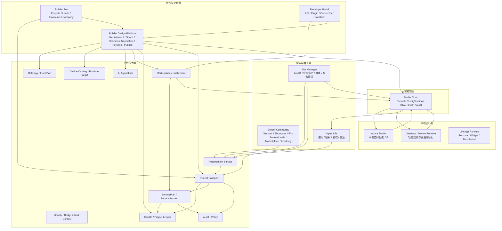
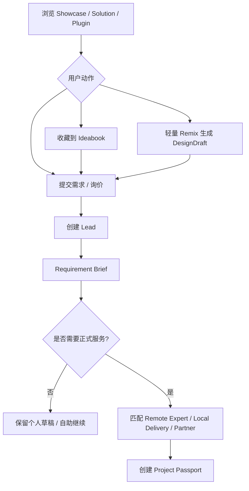
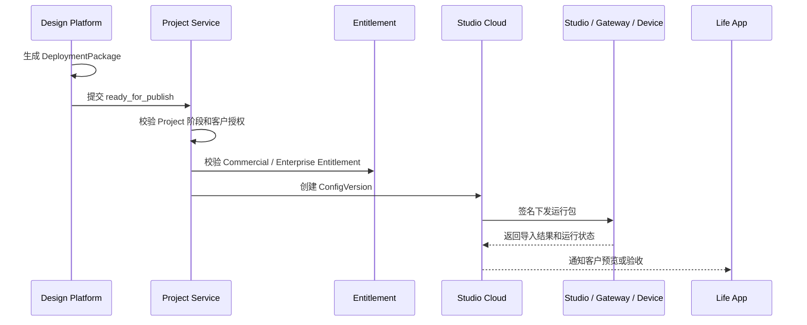
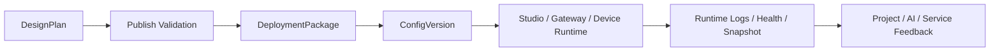

# Aqara Builder 平台产品架构与设计方针

> Version: v1.2
> Status: M0 planning baseline
> Scope: Global product model, Builder Community, Builder Pro, Builder Design Platform, Client Visualization, Aqara Studio, Studio Cloud, Aqara Life, Marketplace, AI, delivery and service loops
> Audience: 产品、设计、研发、运营、商业化、区域团队
> Core principle: **设计全球化，交付本地化。**

---

## 0. 文档定位

这份文档是后续产品设计与研发实现的主方针，不是单个页面 PRD，也不是商业条款全集。

它回答五个问题：

1. Aqara Builder 是什么，不是什么。
2. 全球化、Pro、Team、Partner、计划和 Onboarding 如何建模。
3. 用户需求如何变成可报价、可施工、可部署、可验收、可复用的空间智能资产。
4. Builder Community、Builder Pro、Design Platform、Studio、Life App、Marketplace 和后台服务的边界是什么。
5. MVP 先打通哪些闭环，哪些内容应后置到专项文档。

Professional Profile、个人 / 团队 / Aqara Space 服务组织进入 Builder Pro、Remote Service Console 与 Service Plan 的完整系统架构，见 [`../03-architecture/professional-network-architecture.md`](../03-architecture/professional-network-architecture.md)。

Builder Pro 一级菜单、业务域归属、Project / Work Order 折叠规则和 UI 简洁契约，见 [`./builder-pro-menu-closed-loop-review.md`](./builder-pro-menu-closed-loop-review.md)。

Builder 前台定位、Create / Discover / Community 信息架构、Professional 入口状态机与 Credits 增长飞轮，见 [`./builder-front-and-professional-entry-spec.md`](./builder-front-and-professional-entry-spec.md)。该文档为 Builder 前台的绑定规约。

本文主动下沉的内容：

| 下沉内容 | 原因 | 应放位置 |
|---|---|---|
| 具体价格表、区域价格、发票、税务、分账、提现 | 变化快，且会拖慢主架构阅读 | 商业化专项、`service-billing-model.md` |
| Forum、Shop、Academy 的详细 IA | 属于站点运营和增长细节 | `community-spec.md`、Academy 专项 |
| Studio Web 设备列表、抽屉、显示设置 | 属于产品规格和 UI 细节 | Studio Web / 设备管理 PRD |
| Design Platform 夹点、构件、工具全集 | 属于编辑器能力规划 | Design Platform 专项 PRD |
| 三维重建、多雷达、多模态空间推理 | 属于长期技术专项 | 空间智能技术路线 |
| 平台保险池、国家代理、区域返利 | 属于组织与计费治理 | `global-network-model.md`、`service-billing-model.md` |

---

## 1. 核心结论

Aqara Builder 不应被理解成单一设计工具，也不应被理解成 Installer 派单平台。它的定义是：

> **以 Builder Design Platform 为核心创作引擎、以 Aqara Studio 为本地运行终点的全球空间智能共创、交付、运营与商业化平台。**

用户成长路径是一座责任金字塔：

```text
          Do it Professional
      认证专业人 / 团队 / 服务组织承担交付责任

              Do it AI
      AI 降低设计、沟通、诊断和交付成本

            Do it Yourself
      用户自助探索、Apply、微调和日常使用
```

这三层不是三套互斥产品，而是同一平台里的三种责任模式。`Do it AI` 不是一种独立账号身份，而是贯穿用户自助和专业服务的能力层。

主链路：

```text
用户场景需求 / 预算 / 户型 / 约束
-> Requirement Brief
-> Design Platform 生成和校准方案
-> SpaceModel / DevicePoint / Automation / Persona / Plugin 形成 DesignPlan
-> ClientVisualizationPackage 生成客户可感知的效果图、视频或可走动预览
-> QuoteDraft / ClientReviewPackage / InstallerHandoff
-> DeploymentPackage
-> Studio Cloud 签名分发
-> Aqara Studio 本地运行
-> Aqara Life 授权、预览、验收、日常使用
-> 服务、评价、Showcase、模板和数据回流
```

四个飞轮：

| 飞轮 | 路径 | 目标 |
|---|---|---|
| 创作飞轮 | 需求 -> AI 初稿 -> 设计师校准 -> 成交可视化 -> 可部署资产 -> 模板复用 | 降低设计、沟通和成交成本 |
| 项目飞轮 | Lead -> Project Passport -> Visual Review -> Quote -> Install -> Studio -> Service | 提升成交率、交付质量和长期收入 |
| 内容飞轮 | 真实项目 -> Showcase -> Lead -> 新项目 | 形成获客和信任网络 |
| 数据飞轮 | 运行数据 -> 质量标注 -> 推荐与 AI 优化 -> 更低返工 | 让平台越交付越聪明 |

三条第一性原则：

1. **Design Platform 是创作引擎**：需求、空间、设备、自动化、Persona、报价、风险和发布都围绕它形成设计态资产。
2. **Aqara Studio 是运行终点**：真实交付最终必须落到 Studio、网关或设备侧运行目标，云端不能替代本地运行。
3. **Project Passport 是商业主线**：客户、方案、报价、施工、授权、验收、账本、售后和归因必须挂在 Project 上。

Builder Pro 的一级信息架构固定为四个经营域：

```text
Projects
Leads
Financials
Company
```

`Design`、`Delivery`、`Remote Service`、`Service Plans`、`Marketplace`、`Ledger`、`Customers`、`Spaces / Studios` 都不是默认一级菜单。它们是 Project、Lead、Financials 或 Company 内部的能力、子页面或快捷动作。

与 Pro 相关的四个边界：

| 对象 / 模块 | 定位 | 不应承担 |
|---|---|---|
| Space Design | 空间方案与设计服务资产；在 Pro 中作为 Project Passport 的 Design Package | 不等同于商业项目本身 |
| Life Dashboard | 客户日常体验层；负责家庭成员、Persona、首页布局、权限和常用场景 | 不作为 Pro 远程服务界面 |
| Remote Service Console | Pro 授权后远程诊断、调优、服务会话和报告的专业工作台 | 不面向家庭成员日常使用 |
| Service Plan | 持续服务的商业对象；定义范围、SLA、授权、续费和责任方 | 不等同于 Life Dashboard 或一次性工单 |

成交可视化是 Builder Pro 的关键销售能力，但它不是第四个事实源。效果图、视频和可走动预览都必须从 `RequirementBrief`、`SpaceModel` 和 `DesignPlan` 派生，用来帮助客户理解体验和价值；真正决定报价、施工、发布和责任边界的仍然是 `Project Passport`、`DesignPlan`、`QuoteDraft` 和 `DeploymentPackage`。

---

## 2. 全球化模式

Aqara Builder 不建议拆成两个互不相通的产品，也不建议简单做成“一个中国站点 + 一个全球站点”两套独立体系。更稳的模型是：

```text
One Global Product System
-> Regional Site Shells: China Mainland / Global / Region-specific landing pages
-> Regional Compliance: account region, data region, payment, tax, invoice, privacy policy
-> Local Delivery Network: by project market, service area, certification and language
```

结论：**不是两个产品，而是一个全球产品系统 + 多区域站点外壳 + 本地交付网络。**

### 2.1 站点策略

| 层级 | 建议 | 原因 |
|---|---|---|
| 产品模型 | 全球统一 | Studio、Project、Builder Pro、Marketplace、Academy、Find Professionals 使用同一套信息架构 |
| 站点外壳 | 中国站 + 全球站 + 区域入口 | 满足 ICP、PIPL、支付、发票、税务、语言和营销投放差异 |
| 数据与合规 | 按账号注册国家和项目市场分区 | 账号区域、数据区域和服务市场要可审计，不能只靠语言判断 |
| 服务交付 | 本地化 | 安装、验收、售后、拿货、发票、质保必须落在项目所在地 |
| 远程能力 | 全球化或区域化 | 设计、审图、自动化建议、开发者集成、授权远程支持可以跨市场匹配 |

### 2.2 多语言、市场与数据区域

多语言不等于市场。平台需要拆开以下字段：

| 字段 | 含义 | 示例 |
|---|---|---|
| UI Language | 用户界面语言 | 中文、English、Italiano、العربية |
| Service Languages | Pro 可服务语言 | 中文 + English |
| Account Region | 账号注册国家 / 地区 | China Mainland、United States |
| Primary Market | Pro 主要经营市场 | Europe、UAE、Korea / Japan |
| Project Market | 项目交付所在地 | Milan、Dubai、Seoul、Shanghai |
| Data Region | 数据落地区域 | CN、EU、US、KR |

这意味着一个中国用户可以用英文界面；一个意大利 Builder 可以远程服务英国客户；但现场安装仍要匹配英国本地交付能力。

### 2.3 Find Professionals 双意图

Find Professionals 不能只理解成“找本地施工人员”。它应该拆成两个意图：

| 意图 | 面向谁 | 是否本地 | 典型任务 |
|---|---|---|---|
| Remote Expert | 远程 Builder、方案顾问、开发者、官方支持 | 可跨市场，但受语言、时区、数据授权限制 | 方案设计、审图、设备选型、自动化建议、插件 / 集成、授权远程诊断 |
| Local Delivery | Installer、Partner、Aqara Space、本地服务商 | 必须本地 | 上门勘测、布线、安装、调试、验收、售后、质保 |

产品入口建议：

1. **Find Remote Experts**：按语言、时区、作品、品类、Badge、评分匹配。
2. **Find Local Delivery**：按项目所在地、服务半径、认证、可预约时间、售后责任匹配。
3. **Handoff to Local Delivery**：远程设计完成后，把 Project Package 交给本地 Installer / Partner 执行。

---

## 3. 身份、角色、Work Context 与计划

> 2026-06-07 定版覆盖：Builder Pro 是专业工作台能力，不是订阅套餐、认证等级或用户角色。Professional Identity 与 Subscription、Certification、Workspace 解耦。Workspace Type 只保留 Personal Workspace / Team Workspace；计费只使用 Personal Plans（Free / Pro）和 Business Plans（Business / Enterprise）。本文旧术语中的 `Work Context` 等同于新版 `Workspace`，`Individual` 等同于 Personal Plan，`Team Plan` 不再作为计划名称使用。

原始的 User、Installer、Developer、Partner、Aqara Staff 平铺模型会导致三个问题：

1. 个人用户看起来可以直接“成为 Partner”，但 Partner 应该是组织资格。
2. Pro 被误解成单一身份，但实际 Pro 可能是 Builder、Installer、Developer、Partner Member 或 Aqara Staff。
3. 付费计划和身份认证混在一起，后续 Team、席位、Badge、线索权益会很难扩展。

推荐拆成七层：

```text
Aqara Account
-> Account Role: Visitor / User / Aqara Staff
-> Professional Identity: Professional Profile
-> Professional Capabilities: Builder / Installer / Developer / Remote Support
-> Subscription: Personal Plans / Business Plans / Trial / Official Grant
-> Workspace: Personal Workspace / Team Workspace
-> Workspace Membership: Owner / Admin / Member / Staff Operator
-> Resource Permission: Studio / Project / Customer / Quote / Credits / Lead / Catalog
-> Badge & Certification: Certified Installer / Certified Builder / Regional Partner / Official Support
```

### 3.1 Account Role

| 角色 | 定义 | 核心能力 |
|---|---|---|
| Visitor | 未登录访问者 | 浏览公开 Community、Marketplace、案例、文档和部分 Academy 内容 |
| User | 登录后的基础账号 | 收藏、发帖、管理自己的 Studio、请求协助、购买或加入计划 |
| Aqara Staff | Aqara 官方员工或官方授权账号 | 审核、认证、运营治理、官方远程支持、质量管理、客服和区域管理 |

Account Role 不包含 Partner。Partner 是组织，不是个人账号类型。

### 3.2 Professional Identity 与专业能力

Professional Identity 表示用户完成 Professional Onboarding，可进入 Builder Pro，并拥有可配置的 Professional Profile。它不是订阅套餐，也不是认证结果。

| Pro 能力 | 定义 | 是否可叠加 | 是否可公开 |
|---|---|---|---|
| Builder | 使用 Builder Pro 做方案设计、空间规划、自动化设计和项目交付 | 是 | 可作为 Remote Expert 或本地服务 |
| Installer | 现场安装、调试、验收和维护 | 是 | 通常按 Local Delivery 展示 |
| Developer | 插件、Connector、模板、面板和行业系统集成 | 是 | 可作为 Remote Expert 展示 |
| Remote Support | 授权窗口内远程诊断、调试和优化 Studio | 是 | 可作为 Remote Expert 展示，需权限审计 |
| Partner Member | 隶属于 Partner 组织的成员身份 | 是 | 公开展示归属组织，线索和服务责任归 Partner Work Context |

关键规则：

1. Builder 是 Pro 下的专业能力 / 服务称谓，不是唯一账号角色。
2. Installer、Developer、Remote Support 可以和 Builder 叠加。
3. Professional Profile 默认不自动公开；是否进入 Find Professionals 由用户和组织共同控制。
4. Aqara Staff 可以拥有官方支持能力，但不进入公开付费计划，也不默认进入 Find Professionals。

### 3.3 Workspace / Work Context 模型

这里的 Workspace 更准确地说是 **Work Context**：它是 Builder Pro 里的工作上下文，用来决定当前使用哪套席位、Credits、项目、线索、账本、成员和授权。它不是用户家庭的 `Space`，也不是 Project 的事实源。

它在产品里的体现：

| 产品面 | 是否显性展示 | 体现方式 |
|---|---|---|
| Builder Pro | 是 | 顶部 Context Switcher，例如 Personal / Team / Partner / Enterprise；决定 Projects、Leads、Credits、Ledger、Members 的作用域 |
| Builder Community 前台 | 弱展示 | 主要展示个人 Profile、Team / Partner 公开主页、服务卡片和归属标识，不暴露复杂工作区概念 |
| Aqara Life | 否 | 用户只看到 Space、Studio、家庭成员、授权和服务请求 |
| Site Manager / Enterprise | 是 | 以 Site / Organization / Region 作为运维上下文，不进入普通用户前台 |

需要拆开两个概念：

| 概念 | 含义 | 示例 |
|---|---|---|
| Organization | 法律、商业或认证主体 | Team、Partner Company、Aqara Space、Enterprise Customer |
| Work Context | 这个主体在 Builder Pro 里的产品工作上下文 | Personal Context、Team Context、Partner Context、Enterprise Context |

因此 `Partner Organization` 本身不是 Workspace。更准确的理解是：

```text
Partner Organization
-> 通过 Aqara 认证 / 签约获得 Partner Status
-> 在 Builder Pro 中拥有 Partner Work Context
-> 成员以 Partner Member 身份进入该上下文工作
-> 线索、项目、Credits、账本、服务责任归该 Partner Work Context
```

| Work Context | 背后的主体 | 谁可以创建 / 获得 | 付费与权限 | 说明 |
|---|---|---|---|---|
| Personal Context | 个人 Aqara Account | 所有 User | Free 或 Pro | 个人 Studio、草稿、Professional Profile、个人项目 |
| Team Context | Team Organization | User / Professional 创建，或通过邀请加入 | Business Plan / Enterprise Plan / 组织席位 | 小型工作室、安装团队、轻量服务团队；Team 不等于 Partner |
| Partner Context | Partner Organization | 服务商、门店、Aqara Space、区域伙伴申请或签约后获得 | Partner Contract / 区域政策 | 组织认证后获得 Partner 权益、区域线索和交付责任 |
| Enterprise Context | Enterprise Organization | 大型组织、地产、酒店、SI、区域总代理通过合同获得 | Enterprise Contract | 多组织、多区域、SSO、私有目录、审计和合同能力 |

Team 是重要中间层：个人不能直接变成 Partner，但可以先创建或加入 Team，形成服务协作能力；当 Team 具备资质、区域覆盖和合同条件后，再申请 Partner。

#### 3.3.1 Builder Pro 中的呈现原则

Builder Pro 应采用 Houzz Pro 式的专业经营后台心智：它不是 Community 的登录后版本，而是 Pro / Team / Partner / Enterprise 处理线索、项目、设计、服务和账本的业务操作台。

`Work Context` 在 Builder Pro 中通过顶部 Context Switcher 呈现。切换 Context 后，四个经营域的数据范围随之改变：

```text
[Personal · Jun] v     Projects  Leads  Financials  Profile

Personal
- Jun Personal                 Personal · Free / Pro

Teams
- Liang Studio                 Team · Owner
- SmartHome Lab                Team · Member

Partner Organizations
- Aqara Space Shanghai         Aqara Space · Admin
- Dubai Certified Hub          Partner · Member

Enterprise
- Hilton Pilot UAE             Enterprise · Operator
```

Context Switcher 的设计原则：

1. 切换的是工作上下文，不是重新登录账号，也不是切换家庭 `Space`。
2. 当前 Context 决定 Projects、Leads、Credits、Ledger、Members、Assets 和 Settings 的数据范围。
3. 顶部显示当前主体名称、类型 Badge、当前成员权限和关键状态，例如 `Partner · Admin · UAE`。
4. 前台 Community 只展示公开身份和归属，例如个人 Profile、Team 主页、Partner 主页；不要暴露复杂后台 Context。
5. `Partner Organization` 在用户心智上始终是一个被 Aqara 认证 / 签约的组织；`Partner Context` 只是它进入 Builder Pro 后的工作界面。

不同 Context 的默认首页应不同：

| Context | Dashboard 重点 | 高频动作 |
|---|---|---|
| Personal Context | 个人草稿、个人 Leads、远程服务、个人 Credits、Professional Profile 完整度 | 新建 DesignDraft、回复 Lead、编辑 Profile、升级 Pro |
| Team Context | 团队 Inbox、成员任务、共享项目、团队 Credits、交付排期 | 分配项目、邀请成员、查看成员工作量、管理共享资产 |
| Partner Context | 区域线索池、SLA、项目管线、服务质量、认证覆盖、Aqara Space 资源 | 派单、审批报价、查看质量风险、管理服务区域和成员 |
| Enterprise Context | Sites、Studio Groups、服务请求、私有方案、审计、合同额度 | 查看站点健康、发起服务请求、管理成员、查看审计 |

这个设计让 Builder Pro 和 Builder Community 形成清晰分工：

| 产品面 | 心智 | 主要对象 | 设计风格 |
|---|---|---|---|
| Builder Community | 发现、信任、灵感、转化 | Showcase、Profile、Solution、Marketplace、Find Professionals | 内容优先、公开展示、SEO 友好、转化路径清晰 |
| Builder Pro | 经营、交付、协作、责任 | Lead、Project、WorkOrder、Financial Record、Professional Profile、Organization | 工作流优先、信息密度高、状态明确、可操作 |

### 3.4 Subscription 与计划

| 开通路径 | 谁能选择 | 是否付费 | 结果 |
|---|---|---|---|
| Become Professional | 个人 User | 不付费 | 激活 Professional Profile，进入 Builder Pro 基础工作台 |
| Upgrade Pro | Professional 用户 | 个人订阅或试用 | Personal Workspace 获得更多 Credits、高级导出和个人商业项目能力 |
| Create Team | User / Professional | Business / Enterprise 组织计划 | 创建 Company 和 Team Workspace；创建者成为 Owner，可邀请成员 |
| Join Team | 被邀请成员 | 通常由组织付费 | 获得 Team Workspace Membership，Professional Profile 仍归本人 |
| Apply Partner Organization | 组织代表 | 合同、认证或区域政策 | 进入 Partner 审核，不能作为个人计划购买 |
| Join Partner / Aqara Space | 被 Partner 邀请的成员 | 组织付费或合同内权益 | 获得 Partner Member 身份，项目、线索、Credits 归 Partner Context |
| Aqara Staff Official Grant | 官方员工或官方授权账号 | 非公开付费 | 通过 SSO、官方账号或 Manual Grant 开通运营 / 支持权限 |
| Enterprise Contract | 企业客户或大型服务商 | 合同付费 | 私有目录、审计、合规、区域化交付和采购体系 |

规则：个人用户不能直接成为 Partner。个人可以成为 Pro，可以购买 Individual，可以创建 Team，也可以被 Team / Partner 邀请；Partner 必须是组织认证或合同关系。

### 3.5 Onboarding

Onboarding 的目标不是让用户简单“选一个角色”，而是识别用户计划、付费路径、组织归属和是否公开服务。

推荐流程：

```text
1. Service Path
   Personal Builder / Remote Design Expert / Remote Studio Support / Local Delivery Pro / Developer / Partner Org / Aqara Staff

2. Delivery Mode
   Global Remote / Local Delivery / Remote + Local / Private Context

3. Market & Language
   Primary Market / Data Region / UI Language / Service Languages

4. Access & Plan
   Individual Trial or Subscription / Create Team / Join Team / Apply Partner / Join Partner / Staff Grant

5. Profile Basics
   Display name / Professional headline / draft profile

6. Ready
   Confirm Pro capability, Find Professionals visibility, market, language, access path and plan
```

关键交互规则：

1. 选择 **Personal Builder**：默认 Individual，Private Context，不进入 Find Professionals。
2. 选择 **Remote Design Expert / Remote Support / Developer**：默认 Individual，可作为 Remote Expert 公开展示。
3. 选择 **Local Delivery Pro**：默认 Individual，可作为 Local Delivery 展示，按项目市场匹配。
4. 选择 **Partner Org / Aqara Space**：只能选择 Apply Partner、Join Partner、Create Team 或 Join Team；不能作为个人付费计划直接开通 Partner。
5. 选择 **Aqara Staff**：只能走 Official Grant，不进入公开付费计划。
6. 选择 **Create Team**：支付后创建 Team Organization 和 Team Context，用户成为 Team Owner。
7. 选择 **Join Team**：需要邀请码或组织邀请，用户获得 Team Seat。
8. 选择 **Join Partner**：需要 Partner 管理员邀请；成员是 Partner Member，不是个人 Partner。

### 3.6 Professional Profile 与组织进入

Builder Pro 的开通不是创建一个新账号，而是在同一个 Aqara Account 上激活 Professional Profile：

```text
Aqara Account
-> User Profile
-> Professional Profile
-> Badges / Certifications
-> Organization Memberships
-> Work Contexts
```

Builder 前台应在普通用户的 Profile 内提供 `Convert to Professional` 入口，而不是在普通用户侧边栏显示独立的 Professional Profile。Professional Profile 是用户主动激活后的公开信任资产；普通 Profile 与 Professional Profile 应共享头像、内容、作品、关注和登录态，但专业能力、服务区域、Badge、组织归属和接单状态只在 Professional Profile 区域展示。

Builder Pro onboarding 应按场景初始化：

```text
Welcome to Builder Pro
-> choose personal / team / Aqara Space or service organization entry
-> for team: create or join organization/team
-> for personal: introduce yourself
-> choose Client projects or Personal projects
-> describe project type and completion mode
-> capture discovery source
-> optionally leave contact for setup help
-> activate Professional Profile draft
-> enter Builder Pro with Personal Context and optional Organization Context
```

现有 Aqara Space / 服务商组织的进入路径：

```text
老板 / 负责人个人账号登录
-> 激活 Professional Profile
-> Claim / Register Organization
-> Aqara 校验组织
-> 获得 Organization Owner / Admin
-> 邀请员工
-> 员工各自用个人账号加入组织
```

关键原则：

1. 人先进入，组织后绑定；禁止共享“门店账号”。
2. Badge、作品、评分跟个人走；项目商业责任可以归个人、Team、Aqara Space 或服务组织。
3. Aqara Space / 服务商组织在 Builder 中是认证服务组织、项目履约主体和本地信任节点，不是门店 ERP。
4. Builder 不管理门店库存、POS、考勤、租金、陈列和完整内部财务。
5. 组织成员角色与个人 Badge 分离，例如 `Store Manager`、`Project Manager`、`Designer`、`Installer`、`Remote Operator`、`Sales`、`Finance Viewer`。

完整定义见 [`../03-architecture/professional-network-architecture.md`](../03-architecture/professional-network-architecture.md)。

---

## 4. 关键术语消歧

| 术语 | 含义 | 设计约束 |
|---|---|---|
| Work Context | Builder Pro 中的工作上下文 | Personal / Team / Partner / Enterprise；决定席位、Credits、项目、线索、账本和成员作用域 |
| Space | 用户或组织的空间数据容器，代表一个家、办公室、门店、酒店房型等空间资产 | 绑定数据区域，承载成员、Studio、设备、Persona 和空间图谱 |
| Aqara Studio | 部署在现场的本地空间智能 OS 实例 | 是运行终点，不是内容创作工具后缀 |
| Studio Cloud | Studio 的云端控制面 | 负责远程代理、配置分发、健康和审计，不做本地自动化运行时 |
| Site | 企业或商业业主管理多个 Space / Studio 的集合 | 用于 Site Manager，不替代 Project Passport |
| Aqara Space | Aqara 的门店 / 本地服务基础设施品牌 | 是组织与物理节点，不是 Space 数据容器 |
| Project Passport | 正式服务项目的业务对象 | 串联客户、方案、报价、交付、验收、账本和售后 |

---

## 5. 产品边界

### 5.1 Builder 是什么

| 定位 | 含义 |
|---|---|
| 双面平台 | 前台承接用户、内容、案例、Marketplace 和找专业人；后台承接 Pro 的项目、设计、交付和服务 |
| 空间智能创作平台 | 把需求、户型、设备、自动化、Persona、插件、预算和施工约束转成可部署方案 |
| Studio 协作控制面 | 通过 Studio Cloud 把设计态资产安全发布到客户本地 Studio，并接收运行反馈 |
| 全球 Builder Network 操作系统 | 支持 Pro、ACB、Installer、Developer、Partner、Aqara Staff 在同一套模型下协作 |
| 商业证据链系统 | 即使初期线下收款，也要沉淀 Quote、PaymentRecord、Acceptance、ServiceItem 和归因 |

### 5.2 Builder 不是什么

| 不是什么 | 设计约束 |
|---|---|
| 不是论坛 | Forum 支持问题解答，Builder Community 负责灵感、案例、内容飞轮和转化 |
| 不是远程桌面 | 远程 Studio 服务必须走授权时间窗、API Scope、审计和可回滚变更 |
| 不是纯 CAD 工具 | 画图只是手段，最终产物必须可报价、可施工、可部署、可验收 |
| 不是 AI 聊天入口 | AI 必须作用于结构化对象和画布，不停留在文本建议 |
| 不是一开始就做交易平台 | 初期 Partner / Pro 可自收款，平台先做好项目操作系统和账本 |
| 不是云端自动化运行时 | Studio Cloud 是控制面和分发面，自动化执行应下沉到 Studio、网关或设备侧 |

---

## 6. 顶层产品架构



### 6.1 产品面职责

| 产品面 | 面向对象 | 核心职责 | 不负责 |
|---|---|---|---|
| Builder Community | Visitor、User、Pro、Developer、Partner | 灵感、案例、内容、Marketplace 发现、找专业人、Become Pro | 正式项目报价、客户交付、运行配置 |
| Builder Pro | Pro、ACB、Partner Member、Aqara Staff | Projects、Leads、Financials、Company；通过 Project 内的 Work Order 承载设计、交付、远程服务和验收 | 直接编辑复杂空间图谱和自动化节点；把每个能力都做成一级菜单 |
| Builder Design Platform | User 轻量体验、Pro、ACB、Developer、Aqara Staff | 需求结构化、空间建模、方案创作、风险校验、发布包 | 客户主数据、收款状态、组织成员管理 |
| Aqara Studio | Owner、Admin、本地 Installer、Authorized Builder | 本地设备、空间、自动化、插件、日志和运行配置 | 报价、合同、公开 Showcase、商业授权购买 |
| Studio Cloud | 平台、Pro、Studio | 远程代理、签名分发、版本、健康、审计、OTA | 自动化业务逻辑长期云端执行 |
| Aqara Life | Customer、家庭成员、企业使用者 | 日常使用、授权、确认、验收、售后、Persona UI | 专业方案编辑和项目分配 |
| Site Manager | Enterprise、物业、Partner 运维团队 | 多站点、多 Studio、成员、健康、服务请求、升级需求 | 替代 Builder Pro 做项目报价 |
| Developer Portal | Developer、集成商、企业 IT | API、SDK、插件、连接器、Sandbox、审核发布 | 客户隐私数据和项目账本 |

### 6.2 共享底层

| 能力 | 单一事实来源 |
|---|---|
| 账号、身份、认证、Work Context、组织成员 | Identity / Badge Service |
| 需求与验收标准 | Requirement Service |
| 正式服务项目 | Project Passport |
| 空间本体和户型 | Ontology / FloorPlan Service |
| 设计态方案 | DesignPlan |
| 运行态配置 | Studio RuntimeConfig |
| 授权和远程服务 | OperatorGrant / ServiceSession |
| Marketplace 使用权 | Entitlement |
| 持续服务、服务包履约和服务会话 | ServicePlan / ServiceSession |
| 报价、服务项、收款状态 | Project Ledger |
| 审计 | Audit / Policy |

---

## 7. 核心领域对象

### 7.1 对象总览

```text
Lead
-> RequirementBrief
-> ProjectPassport 或 DesignDraft
-> DesignIntent
-> SpaceModel / OntologyGraph / FloorPlan
-> DesignPlan
-> VisualizationBrief / RenderJob / GeneratedMediaAsset
-> ClientVisualizationPackage
-> QuoteDraft / ClientReviewPackage / InstallerHandoff
-> DeploymentPackage
-> StudioCloud ConfigVersion
-> Studio RuntimeConfig
-> Acceptance / ServiceSession / Ledger / Showcase
```

### 7.2 对象边界

| 对象 | 含义 | 创建方 | 单一事实源 |
|---|---|---|---|
| Work Context / Workspace | Builder Pro 中的权限、订阅、席位和组织协作容器 | Identity、Billing、Admin | Identity / Workspace Service |
| Space | 用户或组织的空间数据容器 | Life、Studio、Site Manager、Project | Space / Identity Service |
| StudioInstance | 某个现场的 Aqara Studio 运行实例 | Studio 激活、Studio Cloud 注册 | Studio Cloud / Studio Runtime |
| Lead | 用户需求线索，未必进入正式服务 | Community、Life、Aqara Space、Site Manager | Project / Lead Service |
| RequirementBrief | 结构化需求、预算、约束、验收标准 | Requirement Service、Design Platform | Requirement Service |
| DesignDraft | 个人或轻量体验草稿 | Community、Life、Design Platform | Design Platform |
| ProjectPassport | 正式服务项目的业务主线 | Builder Pro、Project Service | Project Service |
| DesignIntent | 设计目标、体验 Moment、风险偏好 | AI 生成，人确认 | Design Platform |
| SpaceModel / OntologyGraph | 空间树、房间、区域、点位、关系 | Design Platform、Studio | Ontology Service |
| FloorPlan | 楼层底图、比例尺、对齐和图层 | Design Platform、Studio | FloorPlan Service |
| DevicePoint | 规划点位，长期保留 | Design Platform、Studio | Ontology Service |
| DeviceInstance | 已入网真实设备 | Studio | Studio Runtime / Studio Cloud 摘要 |
| Binding | 点位与真实设备的绑定关系 | Studio、Installer、Authorized Builder | Studio Runtime，云端留审计摘要 |
| DesignPlan | 可评审、可报价、可发布的设计方案版本 | Design Platform | Design Platform |
| VisualizationBrief | 面向客户成交的可视化任务说明，包括房间、场景、风格、镜头、时长和真实约束 | Design Platform、Builder Pro | Visualization Service |
| RenderJob | 调用内部渲染器或外部世界模型生成效果图 / 视频 / 3D 预览的异步任务 | Visualization Service、AI Agent Hub | Visualization Service |
| GeneratedMediaAsset | 生成后的图片、视频、可走动预览或导出资产，带来源、版本和审批状态 | Visualization Service | Content / Asset Service |
| ClientVisualizationPackage | 经 Builder 审批后可分享给客户的可视化素材集合 | Builder Pro、Visualization Service | Project / Visualization Service |
| QuoteDraft | BOM、服务项、折扣、商业授权、付款状态 | Builder Pro、Partner | Project Ledger |
| ClientReviewPackage | 给客户看的体验、预算、可视化素材和待确认项 | Design Platform、Builder Pro | Project Service |
| InstallerHandoff | 给现场人员的施工、点位、入网和验收材料 | Design Platform、Builder Pro | Project Service |
| DeploymentPackage | 可签名、可发布、可回滚的运行包 | Design Platform、Deployment Service | Deployment Service |
| OperatorGrant | 远程或现场服务授权 | Life、Studio Web、Project、ServicePlan | Remote Service |
| Entitlement | 谁能在什么范围使用某资产 | Marketplace / Entitlement Service | Entitlement Service |
| ServicePlan | 客户名下的持续服务实例，定义范围、SLA、授权、续费和责任方 | Builder Pro、Marketplace、Aqara Life | Service Plan Service |
| ServiceSession | 一次具体远程或现场服务动作，记录授权、操作和报告 | Remote Service Console、Aqara Life | Remote Service / Audit |
| ProjectLedger | 报价、服务项、收款状态和未来可结算数据 | Builder Pro、Partner | Ledger Service |
| Showcase | 脱敏后的公开案例和增长内容 | Portfolio / Showcase Composer | Content Service |

### 7.3 Project Passport

`Project Passport` 是正式项目的单一事实来源。它不是普通详情页，而是项目作战室。

最低可用完整度：

| 模块 | Ready 条件 | 缺失风险 |
|---|---|---|
| Brief | 客户、空间、预算、约束和验收标准已结构化 | 无法报价，反复沟通 |
| SpaceModel | 户型、房间、点位和关键关系已建立 | 方案不可施工，不可复用 |
| DesignPlan | 方案版本可评审、可报价或可发布 | 设计结果无法进入商业和交付 |
| Quote | BOM、服务项、授权和金额可确认 | 收入与责任不清 |
| Handoff | Installer 知道装什么、装在哪、如何验收 | 返工和现场混乱 |
| Studio Runtime | 客户 Studio 已绑定，授权和运行目标清楚 | 交付后无法维保 |
| Acceptance | 客户签字、运行验证、照片或报告进入证据链 | 尾款、保修和争议缺依据 |
| Ledger | 报价、收款状态、服务项、验收状态可追踪 | 未来托管、分账、发票无法接入 |

项目阶段建议：

```text
lead
-> requirements
-> designing
-> quoted
-> scheduled
-> installing
-> pending_acceptance
-> delivered
-> in_service
-> closed / disputed
```

设计原则：

1. Project 状态由 Builder Pro / Project Service 主导。
2. Design Platform 只能提交状态变更请求，例如 `ready_for_quote`、`ready_for_publish`。
3. Life App 的客户确认和验收必须回写 Project Passport。
4. Studio 运行态变化如果影响原方案，生成 `StudioSnapshot` 或 `SiteChangeRequest` 回流 Project。
5. Project 关闭后，方案版本、授权、归因和服务责任冻结。

### 7.4 设备点位与真实设备分离

设备删除、返修、重入网或网关迁移时，户型图上的点位不应消失。

| 对象 | 说明 |
|---|---|
| DevicePoint | 设计或运行中保留的点位，包含位置、安装面、高度、朝向、覆盖范围 |
| DeviceInstance | 真实入网设备，包含 Studio 内部 ID、名称、型号、协议、网络地址、在线状态 |
| Binding | 点位和真实设备之间的绑定关系，有历史和审计 |

设备实例标识不依赖 SN。优先使用 `studioDeviceId`，`MAC + model + protocol + gatewayId / endpointId` 只能辅助匹配，`serialNumber` 是可选增强字段。

---

## 8. 关键业务流程

### 8.1 从灵感到正式项目



规则：

1. Lead 不等于 Project。只有涉及客户、报价、授权、验收或商业责任时才生成 Project Passport。
2. Community 的轻量 Remix 只生成 DesignDraft，不允许直接发布到客户 Studio。
3. 来源归因必须保留，用于 Showcase 到 Lead 的内容飞轮分析。

### 8.2 从需求到 AI Native 方案

```text
Requirement Brief
-> Design Intent
-> SpaceModel / FloorPlan / OntologyGraph
-> 多个 Solution Option
-> DevicePoint / BOM / Scene / Automation / Persona / Plugin Dependency
-> RiskAssessment
-> VisualizationBrief / RenderJob / GeneratedMediaAsset
-> ClientVisualizationPackage
-> QuoteDraft
-> ClientReviewPackage
```

AI 的职责：

| 阶段 | AI 负责 | 人负责 |
|---|---|---|
| 需求进入 | 抽取预算、空间、人物、痛点、约束和验收标准 | 确认需求真实性，补关键缺口 |
| 空间建模 | 户型识别、房间命名、关系建议 | 校准比例、边界、房间和结构 |
| 方案生成 | 给出 2 到 3 个方向、设备组合和预算区间 | 选择方向，加入专业判断 |
| 体验编排 | 生成场景、自动化和 Persona 草稿 | 确认触发、权限、隐私和用户体验 |
| 成交可视化 | 生成效果图、视频、可走动预览和镜头脚本 | 确认可视化是否准确表达真实方案 |
| 风险校验 | 发现覆盖、协议、施工、预算和授权风险 | 决定替换、拆阶段或升级方案 |
| 商业辅助 | 生成 BOM、工时、服务项、授权提醒 | 调整报价、毛利、责任和合同边界 |

AI 不能直接做的事：

1. 直接控制高风险设备。
2. 直接发布客户 Studio 配置。
3. 替人确认报价、施工责任、隐私授权和验收。
4. 绕过 Entitlement 和 Runtime Target 校验。

### 8.3 成交可视化：效果图、视频和可走动预览

Builder Pro 在方案设计阶段需要帮助 Pro 成交。客户往往不理解点位图、BOM 或自动化节点，但能理解“回家、观影、起夜、会客、离家”这些体验 Moment。因此平台需要把结构化方案转成客户可感知的视觉叙事。

产品定位：

| 不是 | 是 |
|---|---|
| 独立 AI 画图工具 | Project 和 DesignPlan 下的销售辅助能力 |
| 施工图或最终交付承诺 | 帮客户理解体验、风格、灯光、设备价值和预算差异 |
| 替代 SpaceModel / DesignPlan 的事实源 | 从事实源派生的可视化版本 |
| 只生成一张漂亮图 | 支持图片、短视频、可走动预览、场景对比和客户评论 |

推荐链路：

```text
DesignPlan
-> VisualizationBrief
-> 选择房间 / Moment / 风格 / 预算档位 / 镜头
-> RenderJob
-> External World Model Provider，例如 World Labs Marble
-> GeneratedMediaAsset
-> Pro Review
-> ClientVisualizationPackage
-> ClientReviewPackage
-> Quote Revision 或 Quote Accept
```

`VisualizationBrief` 应包含：

| 字段 | 示例 | 作用 |
|---|---|---|
| Source DesignPlan | `designPlanId + version` | 保证生成结果可追溯 |
| Rooms / Zones | 客厅、主卧、玄关 | 决定生成范围 |
| Experience Moments | 明亮模式、观影模式、晚安模式、起夜模式 | 把智能体验视觉化 |
| Device Highlights | 窗帘电机、灯带、Presence Sensor、安防面板 | 突出设备价值，不只做装修风格图 |
| Style Reference | 现代简约、轻奢、Aqara Space 展厅风 | 控制室内风格 |
| Constraints | 不改硬装、不移动承重墙、预算上限、可施工 SKU | 防止生成不可落地效果 |
| Output Type | still、short_video、walkthrough、before_after | 决定 Credits 和等待时间 |

Marble / 世界模型接入原则：

1. 使用 `Visualization Service` 做 provider adapter，不在产品流程里硬编码 Marble。第一版可以接 `MarbleProvider`，未来可替换或并用内部渲染、区域模型、企业私有模型。
2. Marble 类世界模型适合作为高保真空间生成、镜头漫游和风格化效果的生成器；Aqara 自己的 `DesignPlan` 仍负责设备、点位、自动化、报价和可发布性。
3. 生成结果进入 `GeneratedMediaAsset`，必须记录 `provider`、`modelVersion`、`sourceDesignPlanVersion`、`promptHash`、`seed`、`generatedAt`、`creditsCost`、`reviewStatus`。
4. 面向客户分享前必须经过 Pro 审阅。涉及真实家庭照片、户型、地址、人物或私人物品时，必须先脱敏或获得明确授权。
5. 客户看到的文案应明确这是“方案效果预览”，最终交付以报价、现场勘测、可施工设备和验收清单为准。
6. 生成素材可用于 `ClientReviewPackage`；若要进入公开 Showcase，需要重新走脱敏、授权、归因和内容审核。

Builder Pro 交互建议：

1. 在 Project 的 Design 阶段提供 `Visualize for Client` 主按钮，而不是单独放一个无上下文的 AI 图片入口。
2. 左侧选择房间、Moment、预算档和客户关心的问题；中间显示当前 DesignPlan 画布；右侧 AI Panel 生成可视化 Brief 和可编辑提示词。
3. 输出页使用版本对比：`Option A / B / C`、生成时间、Credits 消耗、来源 DesignPlan、客户反馈和是否纳入评审包。
4. 客户在预览链接里评论“喜欢这个灯光氛围”或“不要这种吊顶”时，系统应转成 `DesignChangeRequest`，由 Pro 决定是否更新 DesignPlan 和 QuoteDraft。

### 8.4 客户评审、报价与交付

```text
DesignPlan Reviewable
-> ClientVisualizationPackage
-> ClientReviewPackage
-> 客户按房间、体验 Moment、预算、隐私和施工影响评论
-> QuoteDraft / Quote Revision
-> 客户确认服务范围
-> DesignPlan Publishable
-> InstallerHandoff
-> 现场安装、入网、点位映射、调试
-> Acceptance Checklist
```

报价锁定规则：

1. 方案进入 `quoted` 后，BOM、服务项、授权、项目范围和交付阶段形成报价基准。
2. 影响预算、施工、授权或运行目标的改动必须生成 Quote Revision。
3. 客户接受报价后，DesignPlan 进入 `publishable`，只能做不影响责任和价格的轻微修正。
4. 现场发现必须换设备、移点位或改自动化时，Installer 提交 Site Change Request。

### 8.5 发布到运行目标



运行目标：

| 目标 | 能力 | 访问方式 |
|---|---|---|
| Studio Runtime | 完整空间图谱、插件、自动化、日志、本地控制台 | 可远程授权打开 Service Mode |
| Gateway Runtime | 轻量自动化、部分 Connector、局部规则执行 | 只能接收签名包，不能远程打开本地控制台 |
| Device Runtime | 设备侧轻量规则、参数和低延迟策略 | 只能下发设备支持的能力子集 |
| Life App Runtime | Persona、Widget、Dashboard、快捷入口 | UI 展示和用户确认，不承担本地低延迟控制 |
| Sandbox Runtime | 开发、调试、审核、兼容性测试 | 不触达真实家庭 |

关键规则：

1. Studio Cloud 不是运行时，只做控制面、隧道、签名分发、审计和健康汇聚。
2. 自动化默认不云端执行。如果没有 Studio、网关或设备侧可执行目标，应阻止发布。
3. 普通网关不是 Studio，例如 M200 可以执行签名自动化包，但不能当作远程 Studio 控制台。
4. 发布前必须校验目标能力、插件依赖、商业授权、用户授权和回滚策略。

### 8.6 交付后服务

```text
Studio 运行
-> 健康和异常摘要上报
-> Life App 告警 / 用户反馈 / 售后请求
-> Support Request 或 Service Project
-> Owner / Admin 授权 OperatorGrant
-> Authorized Builder 进入 Studio Web Service Mode
-> 诊断、修复、部署、回滚
-> Service Report / Audit / Ledger / 续费机会
```

原则：

1. 默认只读，配置修改、部署、重置、删除等高风险动作需要明确授权和二次确认。
2. Owner / Admin 可随时撤销授权。
3. 所有查看、修改、部署和回滚必须写审计。
4. 服务结果应生成报告，并回写 Project 或 Support Request。

---

## 9. Builder Build Platform 方针

Build 是 Builder 的统一 AI Agent 创作入口；Aqara Design 是其中的空间方案工作流。它 Web-first，允许 Community 轻量试用，也允许 Builder Pro 带正式 Project Passport、Home Snapshot 或 Plugin Project 进入专业创作。桌面端可作为后续高阶增强，但不是第一入口。

### 9.1 五条工作流

| 工作流 | 用户 | 核心目标 |
|---|---|---|
| Requirement-led Design | User、Pro、Partner 销售、Aqara Space 顾问 | 把自然语言、图片、户型、预算和约束转成 Requirement Brief |
| Solution Authoring | User、Pro、ACB、Installer、Aqara Staff | 做空间、点位、方案、报价、客户评审和发布 |
| Life Dashboard | User、Pro、ACB | 基于已有 Studio / Home 数据，为家庭成员生成 Aqara Life 看板 |
| Client Visualization | Pro、Partner 销售、Aqara Space 顾问 | 把 DesignPlan 生成客户可感知的效果图、视频、可走动预览和对比叙事 |
| Automation Flow Authoring | 高阶用户、Pro、Installer、Developer | 面向真实设备和运行目标编排 Flow |
| Protocol Driver Authoring | Developer、集成商、高阶 Pro | 通过 MQTT / HTTP / TCP / UDP 文档解析生成设备驱动并测试部署 |

产品入口上，专业创作不应散落成互相割裂的小工具。`/build?entry=personal` 是 Builder 前台用户的 Build 入口，承接自用方案、Life Dashboard 和 AI 助手；`/build?entry=pro&workflow=space` 进入 Space Workflow，承接户型、空间树、FloorPlan、DevicePoint 和覆盖校验；`/build?entry=pro&workflow=visualization` 进入 Client Visualization Workflow，承接效果图、视频、可走动预览和客户评审包；`/pro/build/dashboard` 进入 Life Dashboard Builder，基于已有 Studio / Home 数据生成成员看板；`/pro/build/driver` 进入 Protocol Driver Agent，承接协议解析、JSON、JS、测试和 Studio 部署。插件、连接器、Widget 和服务包不再作为独立 Plugin Builder 入口出现，统一通过 Marketplace / Developer Portal 上架，通过授权中心进入项目部署链路。FloorPlan 激活属于 Space Workflow，不应作为 `/manage/floorplans/activation` 的独立产品面存在。

### 9.2 任务阶梯

正式项目模式下，Build Space 应使用任务阶梯，而不是全功能导航：

```text
1. Clarify Brief
2. Build Space
3. Generate Options
4. Refine Experience
5. Visualize for Client
6. Check Risks
7. Prepare Quote
8. Review With Client
9. Publish / Handoff
10. Reuse / Showcase
```

设计原则：

1. 首屏回答“下一步要做什么”，不要一次性铺开所有能力。
2. 左侧面板随阶段变化：需求阶段是 Brief，报价阶段是 BOM，交付阶段是 Handoff。
3. 右侧 AI Panel 只服务当前任务，不做无上下文全局聊天。
4. `Visualize for Client` 必须读取当前 DesignPlan 版本；客户基于效果图提出的修改要回写为 DesignChangeRequest，而不是直接改动事实源。
5. 底部商业栏在 `Prepare Quote` 后强化展示，早期只显示预算区间。
6. 同一份 DesignPlan 按角色显示不同视图：设计师看专业画布，客户看评审包，Installer 看 Handoff，Partner Manager 看进度和账本摘要。

### 9.3 AI Native 原则

| 原则 | 产品要求 |
|---|---|
| 结构化输入 | AI 读取 RequirementBrief、SpaceModel、DeviceCatalog、ProjectScope、Entitlement、RuntimeTarget |
| 画布级修改 | AI 建议作用到具体房间、点位、自动化节点、报价项或风险项 |
| 多方案并行 | 默认给出经济型、均衡型、高阶型等可比较方向 |
| 多模态可视化 | 把方案转成图片、视频、可走动预览和场景对比，但必须保留生成来源和审批状态 |
| 解释可追溯 | 推荐要说明依据：需求、空间关系、设备能力、预算、过往项目或运行目标 |
| 人类最终决策 | 设备替换、价格、施工责任、隐私和高风险控制必须人确认 |
| 结果可发布 | 输出进入 DesignPlan、AutomationFlow、QuoteDraft、DeploymentPackage 等版本化对象 |
| 数据可回流 | 设计师接受、拒绝、修改 AI 建议的原因要沉淀为标注数据 |

### 9.4 MVP 编辑能力

| 能力 | 目标 |
|---|---|
| 户型导入和比例尺 | 支撑房间和点位定位 |
| 墙、门、窗、房间 | 建立基础 SpaceModel |
| 空间树和图层 | 管理楼层、房间、区域和对象显示 |
| DevicePoint | 规划设备点位和安装属性 |
| 基础覆盖展示 | 支撑摄像头、雷达、网关等关键设备校验 |
| Automation Flow 基础节点 | 触发、判断、执行、调试、目标能力校验 |
| RiskAssessment | 覆盖、协议、预算、施工、授权风险 |
| DeploymentPackage | 可签名、可下发、可回滚 |

---

## 10. Marketplace、Credits 与 Entitlement

Marketplace 初期不做自由定价插件商店。更合适的路径是：

```text
免费传播和社区激励
-> Pro / Partner 项目使用
-> 商业部署触发授权
-> Credits 承担 AI、工具资源和授权兑换
-> 成熟后再开放更复杂的交易、分佣和提现
```

### 10.1 内容类型

| 类型 | 初期策略 |
|---|---|
| Studio Plugin | 官方和认证插件优先，工程型插件走 Commercial / Enterprise 授权 |
| Device Connector | Free / Pro / Commercial 分层 |
| Automation Flow Package | 个人试用免费，项目部署需授权 |
| Life App Widget | 免费或 Credits 解锁 |
| Scene Pack / Template | 免费传播，优质内容进入 Creator Rewards |
| Solution Template | Community 可预览，Pro 项目使用需权限 |
| Render Style Preset / Visualization Template | 基础风格免费，高成本世界模型生成按 Credits 或计划额度消耗 |
| Service Pack | 初期作为 Partner 服务项记录，后期接平台交易 |
| Private Solution | 企业定制和组织私有分发 |

### 10.2 Entitlement 规则

Entitlement 记录“谁可以在什么范围内使用什么资产”。它比购买记录更重要。

| 维度 | 示例 |
|---|---|
| Subject | user、workspace、project、studio、studio_group |
| Asset | plugin、connector、template、solution、widget、service_pack |
| Permission | free、pro、commercial、enterprise |
| Source | free、plan_included、credits、partner_policy、contract、manual_grant |
| Scope | region、expiresAt、auditRequired |

原则：

1. Professional Identity 是人的专业身份；Subscription 是计费权益；Commercial Entitlement 是资产在项目中的使用权。
2. 商业授权优先绑定 Project、Studio 或 Studio Group，而不是永久绑定个人。
3. 浏览模板时不强打断，发布到商业项目或客户 Studio 前再校验。
4. 免费官方基础协议和 Aqara 自有设备驱动应尽量降低商业门槛。
5. 工程协议、行业连接器、企业方案和高维护成本资产适合 Commercial / Enterprise 授权。

授权中心的业务流应是：

```text
Marketplace 购买 / Credits 兑换
-> 进入 Authorization Pool
-> 选择插件或资产
-> 按 Project 分配 Entitlement
-> 根据 Project 下的 Space / Studio 绑定 Runtime Target
-> 部署、审计、续费或撤销
```

Pro-only 插件不能只因为个人购买就直接部署到客户 Studio。它必须先生成项目级 Entitlement，再落到该 Project 关联的 Space / Studio。家庭项目通常是一个 Project、一个 Space、一台 Studio；楼宇项目通常是一个 Project、一个 Space、多台 Studio；银行和连锁项目通常是一个 Project、多个 Space、每个 Space 多台 Studio。撤销项目授权时，Studio Runtime Binding 也必须一并失效，但 Marketplace 购买记录仍保留在 Authorization Pool。

### 10.3 Credits 边界

Credits 是平台额度，不是用户之间流通的虚拟币。

适合初期使用：

1. AI 方案生成、户型识别、覆盖仿真、效果图 / 视频 / 世界模型渲染。
2. Design Platform 高级能力消耗。
3. Commercial Entitlement 兑换。
4. Developer Sandbox 资源和审核加速。
5. 培训、认证或活动额度。

不建议初期使用：

1. 开发者自由定价售卖插件。
2. 创作者直接提现。
3. 用户间转账。
4. 复杂退款和二级市场。

---

## 11. 结算与商业化阶段

初期不急于做完整交易平台。

| 阶段 | 收款方式 | Builder 平台职责 |
|---|---|---|
| 阶段 1：Partner / Pro 自收款 | 服务商、门店、专业用户按当地方式收款 | 项目、设计、报价、交付、验收、Studio、服务和收款状态记账 |
| 阶段 2：平台辅助收款 | 平台生成报价、合同模板和付款状态 | 标准化服务包、项目账本、客户确认、区域经营数据 |
| 阶段 3：平台参与交易 | 在线支付、托管、分账、发票、税务 | 抽佣、分成、退款、结算、Marketplace 法币交易 |

初期必须记录：

1. QuoteDraft 和 Quote Revision。
2. BOM、服务项、商业授权需求。
3. 付款状态：未发出、已发出、已接受、线下已收、平台已收。
4. Installer 工单、验收证据、服务责任。
5. Studio 激活和部署归因。
6. Showcase / Lead Attribution。

---

## 12. 权限、安全与隐私

### 12.1 基本原则

1. **本地优先**：Studio 断网仍可运行，本地可配置、可回滚、可审计。
2. **授权先于访问**：任何第三方远程访问 Studio 必须有 Owner / Admin 授权。
3. **Scope 是安全边界**：菜单隐藏不是安全边界，API Scope 才是。
4. **时间窗最小化**：远程服务必须有明确过期时间。
5. **全量审计**：查看、修改、部署、回滚和高风险操作都要写日志。
6. **数据区域隔离**：跨数据中心 Space 不做自动化联动，AI 上下文也隔离。
7. **脱敏再复用**：Showcase、模板、AI 样本和运营分析必须经过授权和脱敏。
8. **外部模型最小必要输入**：调用 Marble 或其他第三方世界模型时，只传生成所需的户型、风格、场景和脱敏素材，不传客户身份、精确地址、联系方式或无关家庭数据。
9. **生成内容可追溯**：效果图和视频必须保留来源 DesignPlan、模型供应商、生成时间、审批人和用途范围。

### 12.2 Studio 资源角色

| Studio 角色 | 定义 | 权限边界 |
|---|---|---|
| Owner | Studio 资产归属方 | 全部权限、转移资产、删除 Studio、授权或撤销服务 |
| Admin | 日常管理员 | 成员、设备、空间、自动化、插件、授权，不能转移所有权 |
| Resident | 常驻成员 | 日常控制和基础状态查看 |
| Guest | 临时访客 | 指定设备或场景的临时控制 |
| Authorized Builder | 被授权服务方 | 在时间窗和 Scope 内诊断、编辑、部署或维护 |

`Authorized Builder` 是服务会话身份，不是永久家庭成员。

### 12.2.1 Space / Studio 可见性

Space 和 Studio 应使用同一套资源与成员权限事实源。用户在 Builder 前台、Aqara Life 或 Studio Cloud 中邀请某人作为 Admin / Member，本质上都是给这个账号授予 Space 角色；Builder Pro 不再创建客户 Space，只把已经授权给当前账号的客户 Space 关联到 Project、OperatorGrant 或 ServiceSession。

因此，同一个客户 Studio 可以同时出现在两个上下文中：

1. **Builder 前台 / 我的空间**：以个人身份查看我拥有、被邀请或可日常使用的 Space，重点是家庭使用和成员管理。
2. **Builder Pro / Space 托管**：以专业服务身份查看与 Project、交付、维保、远程服务窗口和审计记录有关的客户 Space。

为了避免个人空间和客户项目混在一起，Builder Pro 需要额外的业务过滤：只有当 Space 被 Project 引用、存在托管关系、服务合同、OperatorGrant 或交付记录时，才进入 Pro 的 Space 托管视图。未关联项目的私人 Space 即便当前账号是 Admin，也不默认进入 Builder Pro 项目运营列表。

施工阶段需要额外区分 `Project Commissioning Target` 和 `Customer Space`。Studio Web 输入账号后列出的应该是账号真实 Space；如果施工人员真的创建了一个普通 Space，它就应该和 Builder 前台保持一致可见，不应被隐藏。更推荐的产品逻辑是：施工人员上门时不创建隐藏 Space，而是在 Builder Pro 项目中生成一次性 Project Code / QR；Studio Web 选择“项目施工绑定”，输入 Code 后把 Studio 连接到 Project Commissioning Target，用于入网、调试和验收准备。项目交付时再把 Studio 转移到客户账号下的 Customer Space；转移完成后，服务商只保留 Admin、Member 或限时 Authorized Builder 身份。产品上不能把 Project Commissioning Target 表达成普通 Space，它只是 Project 交付链路中的临时运行目标。

### 12.3 OperatorGrant

```ts
interface OperatorGrant {
  studioId: string;
  grantedToUserId: string;
  grantedToRole: 'pro' | 'acb' | 'installer' | 'partner_member' | 'aqara_staff';
  grantType: 'remote' | 'onsite';
  scope: Array<
    | 'view'
    | 'diagnose'
    | 'edit_space'
    | 'edit_device'
    | 'edit_automation'
    | 'plugin_maintenance'
    | 'deploy'
    | 'dangerous_admin'
  >;
  expiresAt: string;
  approvedByUserId: string;
  auditRequired: true;
}
```

### 12.4 数据归属

| 数据 | 默认归属 | 默认策略 |
|---|---|---|
| 户型和空间图谱 | 用户 / 项目 | 本地优先，可授权同步 |
| 设备实时状态 | 用户 | 默认本地，必要摘要上云 |
| Studio 健康指标 | 用户 + Aqara | 脱敏后用于运维 |
| 服务操作日志 | 用户 + 服务方 + Aqara | 必须上云审计 |
| 生成效果图 / 视频 / 可走动预览 | 项目客户 + 生成方授权使用 | 默认只用于项目评审和成交；公开 Showcase 需另行授权、脱敏和审核 |
| Showcase 内容 | 用户 / Pro 授权发布 | 发布前脱敏和确认 |
| AI 训练样本 | Aqara | 必须脱敏、授权和质量评分 |

---

## 13. 系统服务架构

### 13.1 Bounded Context

| 服务 | 职责 |
|---|---|
| Auth / SSO | 登录、Token、账号、基础组织 |
| Identity / Badge / Workspace | Pro、ACB、能力 Badge、认证、Work Context、成员、席位 |
| Requirement Service | Requirement Brief、Design Intent、需求补问、Lead 质量评分 |
| Project Service | Project Passport、Lead、Timeline、状态机、Project Summary |
| Design Service | DesignDraft、DesignPlan、ClientReviewPackage、RiskAssessment |
| Visualization Service | VisualizationBrief、RenderJob、GeneratedMediaAsset、ClientVisualizationPackage、生成审批 |
| Ontology Service | SpaceModel、OntologyGraph、DevicePoint、空间关系查询 |
| FloorPlan Service | 户型图、比例尺、图层、对齐 |
| Device Catalog | SKU、能力、协议、安装条件、替代规则 |
| Runtime Target Registry | Studio、网关、设备侧、Life App、Sandbox 的能力声明 |
| Automation Flow Service | Flow DSL、编译、校验、调试、运行版本 |
| Deployment Service | DeploymentPackage、发布校验、签名、回滚 |
| Studio Cloud | Studio 注册、心跳、隧道、配置分发、健康、OTA、审计 |
| Remote Service | Support Request、OperatorGrant、ServiceSession、服务报告 |
| Marketplace Service | 资产、版本、审核、签名、上下架 |
| Entitlement Service | Free / Pro / Commercial / Enterprise 授权 |
| Credits / Ledger | Credits、Quote、PaymentRecord、ServiceItem、Billing-ready 数据 |
| Content Service | Showcase、Ideabook、评论、归因 |
| AI Agent Hub | LLM Gateway、空间解析、推荐、诊断、内容生成、世界模型 Provider Adapter |
| Audit / Policy | 权限、风控、合规、审计查询 |

第一版避免过度微服务。可以采用模块化单体加清晰 bounded context，规模化后再拆。

### 13.2 成交可视化数据流

```mermaid
flowchart LR
    A[DesignPlan Version] --> B[VisualizationBrief]
    B --> C[RenderJob]
    C --> D[AI Agent Hub Provider Adapter]
    D --> E[Marble / Internal Renderer / Future Provider]
    E --> F[GeneratedMediaAsset]
    F --> G[Pro Review]
    G --> H[ClientVisualizationPackage]
    H --> I[ClientReviewPackage]
    I --> J[Client Comment / Quote Revision]
```



关键点：

1. `DesignPlan Version` 是输入基准。生成后即使 DesignPlan 改版，旧素材也不自动代表新方案。
2. `RenderJob` 是异步任务，需要排队、失败重试、Credits 预估、成本上限和取消能力。
3. `GeneratedMediaAsset` 只能在审批后进入客户评审包。
4. 客户评论不能直接改图或改方案，应生成 `DesignChangeRequest`，由 Pro 决策并同步 QuoteDraft。

### 13.3 发布数据流



---

## 14. MVP 建设范围

### 14.1 Phase 1：项目与设计闭环

必须打通：

1. Identity 基础：User、Pro、ACB / Badge 字段、Work Context、席位和组织成员雏形。
2. Community / Life / Aqara Space 进入 Lead。
3. Requirement Brief：需求、预算、约束、验收标准结构化。
4. Builder Pro Projects：Project Passport、阶段、负责人、客户摘要、Timeline。
5. Design Platform Web-first：户型导入、房间、空间树、点位、基础覆盖。
6. AI 初稿：需求解析、多方案方向、设备推荐、风险提示。
7. Client Visualization MVP：从 DesignPlan 生成 3 到 5 张客户效果图或 15 到 30 秒体验短片，接 RenderJob、Credits、审批和客户评审包。
8. QuoteDraft：BOM、服务项、授权提示、线下收款状态。
9. ClientReviewPackage：客户可读预览、可视化素材和确认。
10. DeploymentPackage 标准结构。
11. Studio Cloud 接收 ConfigVersion 并下发 Studio。
12. Life App / Web 用户授权、预览和验收回写 Project。
13. Audit 基础：发布、授权、验收、远程访问。

暂缓：

1. 完整 3D / 专业 CAD。
2. 全自动派单。
3. 完整托管交易、分账、税务、开发者提现。
4. 大规模模型训练平台。
5. 开放开发者自由定价 Marketplace。
6. 无图建模、多雷达拼接和多模态空间推理。
7. 完全自动生成并直接对客户发布的 AI 视频。

### 14.2 Phase 2：交付与运行闭环

重点：

1. Installer Handoff 和现场工单。
2. 设备入网、候选匹配、点位绑定和解绑历史。
3. Studio RuntimeConfig 版本、回滚和变更审计。
4. Studio Web Service Mode：只读诊断、配置修改、部署、报告。
5. Studio 健康监控、Support Request 和 OperatorGrant。
6. Automation Flow 基础编译和目标能力校验。
7. Gateway / Device Runtime 能力声明，支持轻量自动化下沉。
8. StudioSnapshot 回流到个人草稿或服务项目。

### 14.3 Phase 3：生态与全球网络

重点：

1. Marketplace / Entitlement 完整化。
2. Developer Portal、Plugin Sandbox、Connector 开发和审核。
3. Showcase Composer、内容归因和 Lead 匹配。
4. Academy、Badge、认证、续证和吊销。
5. Partner / Aqara Space 组织主页、团队、服务区域和质量治理。
6. Site Manager、多站点、Private Solution 和 Enterprise Entitlement。
7. 多区域价格、税务、平台收款和结算策略。

---

## 15. 产品指标

| 指标 | 含义 |
|---|---|
| Requirement Brief 完成率 | 用户需求能否被结构化 |
| Lead 到 Project 转化率 | 需求质量与匹配质量 |
| 需求到 DesignDraft 转化率 | Design Platform 是否承接真实需求 |
| AI 初稿采纳率 | AI 是否真正帮助设计师 |
| 可视化生成到客户评审转化率 | 效果图 / 视频是否真正进入成交沟通 |
| 可视化素材采纳率 | Pro 认为生成素材可用于客户沟通的比例 |
| 首次可报价时间 | 从 Lead 到 QuoteDraft 的效率 |
| Showcase 到 Lead 转化率 | 内容飞轮效果 |
| DesignPlan 到 DeploymentPackage 转化率 | 创作成果是否能进入真实发布 |
| 报价接受率 | 方案和价格匹配度 |
| 可视化后报价接受率提升 | Client Visualization 对成交的真实贡献 |
| 现场变更率 | 设计可实施性 |
| 验收通过率 | 项目交付质量 |
| Studio 激活率 | 项目是否落地 |
| Studio 在线率 | 运行基础质量 |
| 自动化成功率 | 方案运行质量 |
| 服务包续费率 | 长期价值 |
| AI Credits 消耗 | AI 能力商业化程度 |
| 单 Studio LTV | 平台核心商业价值 |

---

## 16. 产品设计与开发检查清单

任何新增功能、页面、API 或数据模型，进入开发前都要回答：

1. 这个功能服务哪类用户：User、Pro、ACB、Installer、Developer、Partner Member、Aqara Staff、Enterprise？
2. 当前激活哪个上下文：Personal Context、Team Context、Partner Context、Enterprise Context、Project、Site、Studio？
3. 单一事实来源是什么：Project Passport、DesignPlan、Studio RuntimeConfig、Entitlement 还是 Ledger？
4. 它属于设计态、运行态、商业态、内容态还是服务态？
5. 是否会触达客户 Studio？如果会，是否有 OperatorGrant、Scope、时间窗和审计？
6. 是否涉及报价、商业授权、Credits 或 Project Ledger？
7. 是否会公开用户数据？如果会，是否有脱敏、授权和撤回路径？
8. 是否跨数据中心？如果会，是否遵守数据区域和自动化隔离？
9. AI 输出是否进入版本化对象，而不是停留在聊天记录？
10. 如果涉及效果图 / 视频 / 世界模型生成，是否记录来源 DesignPlan、供应商、审批状态、Credits 和客户授权？
11. 是否能映射到当前 MVP Phase？如果不能，是否应该下沉为后续专项？

---

## 17. 设计原则

1. 一个全球产品系统，多区域站点外壳。
2. 多语言、市场、数据区域、交付区域必须解耦。
3. Find Professionals 拆成 Remote Expert 与 Local Delivery。
4. Account Role、Pro Capability、Work Context、Membership、Plan、Badge 分层建模。
5. Team 是商业化和协作的关键中间态，Partner 是组织认证结果。
6. Design Platform 是创作引擎，不能退化成聊天框或孤立编辑器。
7. Studio 是运行终点，云端只能做控制面和协作放大器。
8. Project Passport 是正式服务项目的商业主线。
9. Requirement Brief 是创作起点，必须可追溯到原始输入。
10. 设计态和运行态通过 DeploymentPackage、ConfigVersion 和 Snapshot 解耦。
11. 点位和真实设备必须分离，点位长期保留。
12. AI 不越权，关键控制、价格、施工责任、隐私和发布必须人确认。
13. Client Visualization 是成交辅助层，不是施工图、报价或运行配置事实源。
14. Marketplace 免费传播优先，商业授权后置到项目部署前。
15. 初期轻交易，先做项目操作系统和账本，再接平台支付与分账。
16. 普通网关不是 Studio，不能远程打开本地控制台。
17. Studio Cloud 不是插件或自动化运行时。
18. Aqara Space 是本地基础设施，不拥有 ACB 个人身份。

---

## 18. 相关文档

| 文档 | 用途 |
|---|---|
| `../00-vision/brand-architecture.md` | 品牌与命名规则 |
| `../00-vision/strategy-b2b2c.md` | B2B2C 战略 |
| `../00-vision/global-network-model.md` | 全球 Builder Network 和 Aqara Space 组织模型 |
| `./builder-two-sided.md` | Builder 双面平台视角 |
| `./builder-console-spec.md` | Builder Pro 控制台目标态规格 |
| `./builder-workshop.md` | Workshop / Forge / 创作工具细节 |
| `./studio-and-builder.md` | Studio 与 Builder 的关系 |
| `./aqara-life-app.md` | Aqara Life、Persona、Space 和插件底座 |
| `./account-and-studio-lifecycle.md` | 账号、Space、Studio、授权和转移生命周期 |
| `./builder-pro-delivery-flow.md` | Verified Builder 项目交付全流程 |
| `./community-spec.md` | Community 前台规格 |
| `./content-flywheel.md` | Showcase、内容归因和 Lead 飞轮 |
| `../03-architecture/identity-model.md` | 身份、入口和上下文路由 |
| `../03-architecture/data-model.md` | 核心数据实体 |
| `../03-architecture/system-overview.md` | 技术架构和服务拆分 |
| `../03-architecture/api-contracts.md` | API 契约 |
| `../03-architecture/service-billing-model.md` | 服务、账本、分润和资金流专项 |
| `../03-architecture/ai-system.md` | AI 能力架构 |
| `../04-roadmap/milestones.md` | 阶段路线图 |
