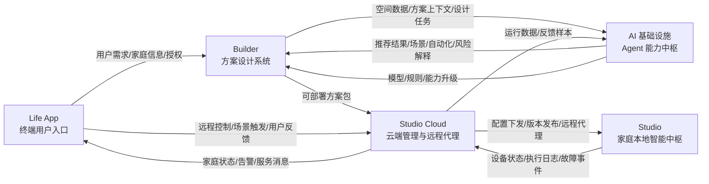
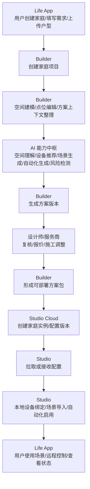
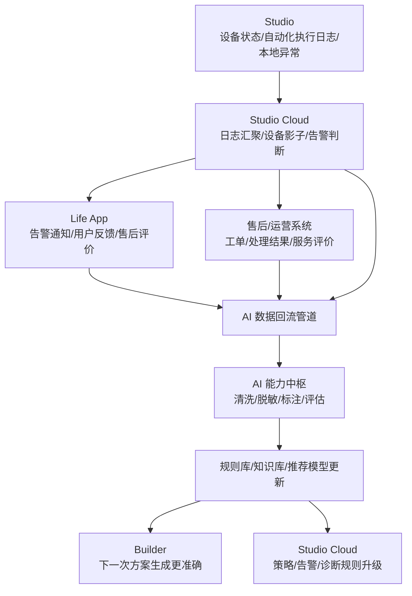
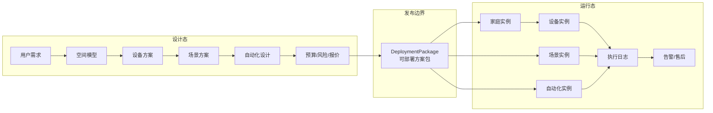
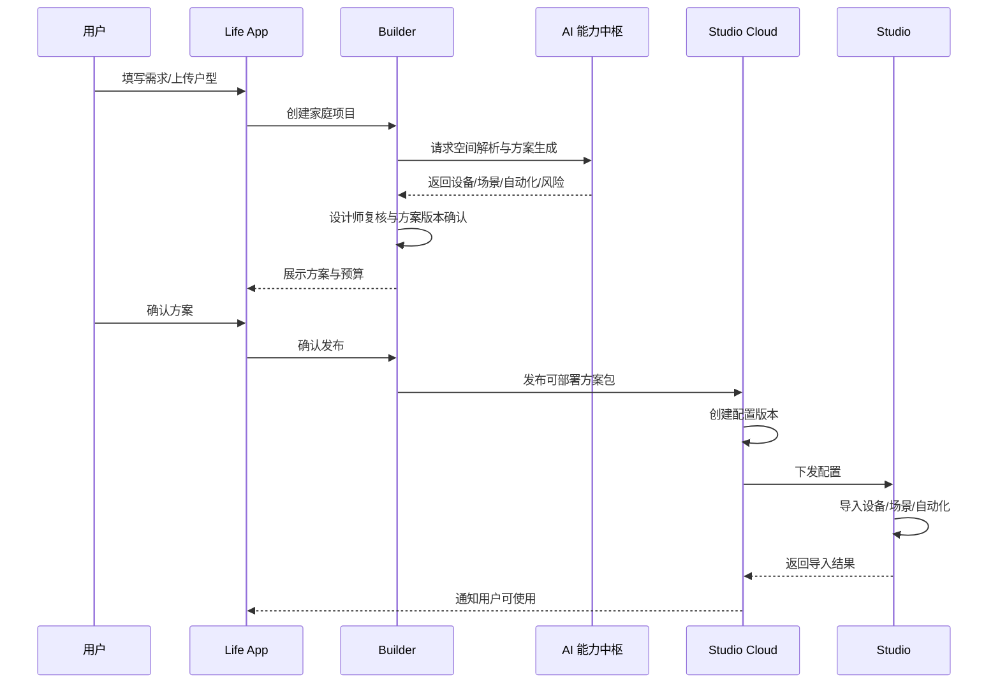
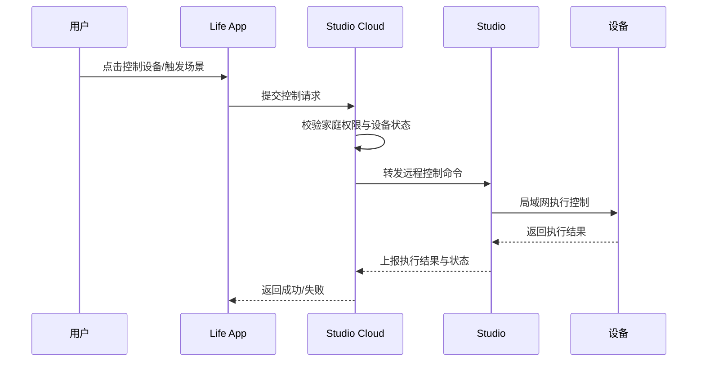
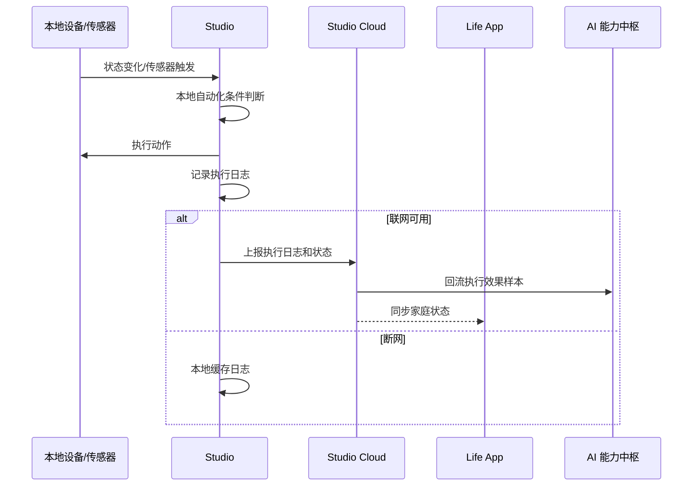
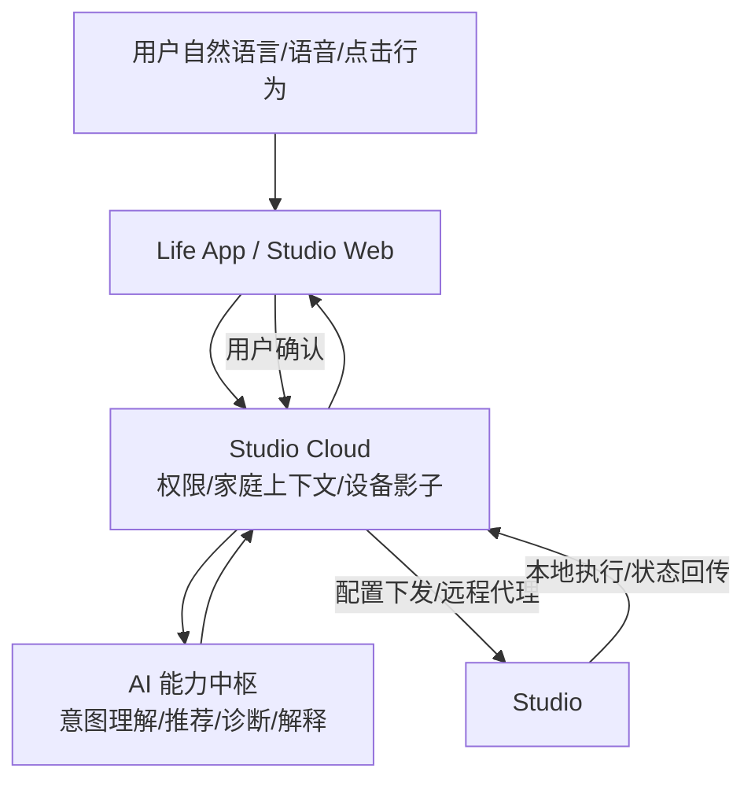
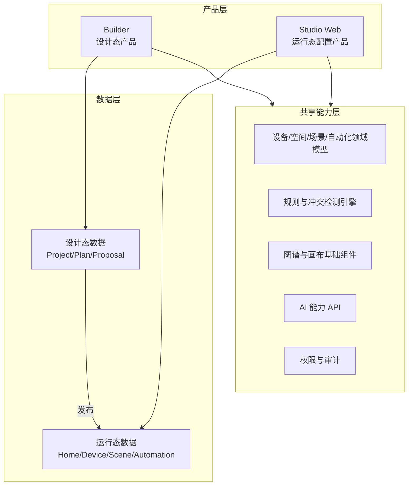
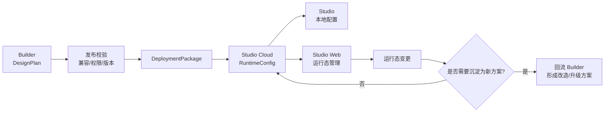

# 智能家居五大子系统数据流与职责划分

## 1. 子系统总体定位

本阶段落地建议将平台拆成五个核心子系统：

1. **AI 基础设施 / Agent 能力中枢**
2. **Builder 方案设计系统**
3. **Studio 本地智能中枢**
4. **Studio Cloud 云端管理系统**
5. **Life App 终端用户入口**

五个系统不是简单的前后端拆分，而是围绕“方案生成、方案交付、本地运行、远程管理、用户服务”形成完整闭环。



## 2. 系统职责划分

| 子系统 | 核心定位 | 主要用户/调用方 | 核心职责 | 不建议承担的职责 |
|---|---|---|---|---|
| AI 基础设施 / Agent 能力中枢 | 平台智能能力底座 | Builder、Studio Cloud、运营后台、未来第三方系统 | 意图理解、空间理解、设备推荐、场景生成、自动化生成、规则推理、风险检测、知识库检索、Agent 编排、模型评估 | 不直接承载用户项目流程，不直接管理订单和交付，不直接控制用户家中设备 |
| Builder 方案设计系统 | 方案生产与交付前设计系统 | 设计师、服务商、平台运营、AI Agent | 家庭项目建模、户型/空间编辑、设备点位设计、场景设计、自动化编排、预算测算、方案版本管理、方案审核、生成可部署方案包 | 不负责长期运行设备，不承担家庭网关职责，不直接处理实时设备控制 |
| Studio 本地智能中枢 | 用户家中的本地运行核心 | 家庭设备、Studio Cloud、本地自动化引擎 | 本地设备接入、本地场景执行、本地自动化执行、本地规则调度、局域网控制、断网可用、设备状态采集、本地日志缓存 | 不做复杂 AI 方案生成，不承接方案设计流程，不管理跨家庭业务 |
| Studio Cloud | Studio 的云端管理与远程代理 | Life App、Builder、Studio、运营后台、售后系统 | 家庭设备云端影子、远程控制代理、配置版本管理、方案包下发、Studio OTA、消息推送、告警、日志汇聚、远程诊断、服务策略分发 | 不代替 Studio 执行本地低延迟自动化，不直接编辑设计方案细节 |
| Life App | 终端用户移动端入口 | 业主、家庭成员 | 需求采集、家庭创建、方案查看确认、远程控制、场景使用、告警接收、授权管理、验收评价、售后入口、复购升级 | 不承载复杂设计工具，不直接编排底层自动化逻辑，不管理平台级模型和规则 |

## 3. 核心数据对象归属

| 数据对象 | 主归属系统 | 主要消费系统 | 说明 |
|---|---|---|---|
| 用户账号与家庭成员 | Life App / 用户中心 | Builder、Studio Cloud | 用户、家庭、成员权限、授权关系 |
| 家庭项目 | Builder | Life App、Studio Cloud、AI | 装修前或改造前的方案项目，不等同于真实运行家庭 |
| 空间模型 | Builder | AI、Studio Cloud、Life App | 户型、房间、墙体、门窗、家具、设备点位 |
| 用户需求档案 | Life App / Builder | AI、Builder | 预算、偏好、装修阶段、家庭成员、生活习惯 |
| 设备 SKU 元数据 | AI 基础设施 / 元数据中心 | Builder、Studio Cloud、Studio | 品牌、型号、协议、能力、价格、安装条件、兼容关系 |
| 方案版本 | Builder | Life App、Studio Cloud、AI | 空间方案、设备清单、点位、场景、自动化、预算、风险 |
| 可部署方案包 | Builder | Studio Cloud、Studio | 面向运行侧的标准化配置包 |
| 家庭实例 | Studio Cloud | Life App、Studio | 已交付、已绑定的真实家庭运行实体 |
| 设备实例 | Studio / Studio Cloud | Life App、AI、售后系统 | 真实设备 SN、房间归属、能力、在线状态、健康状态 |
| 场景实例 | Studio | Life App、Studio Cloud | 可被用户触发的本地/远程场景 |
| 自动化实例 | Studio | Studio Cloud、AI | 本地执行的触发条件、约束、动作、执行记录 |
| 运行日志 | Studio | Studio Cloud、AI | 设备状态、自动化执行结果、失败原因、性能数据 |
| 告警与售后事件 | Studio Cloud | Life App、服务商、AI | 离线、弱信号、低电量、执行失败、用户报修 |
| AI 训练与评估样本 | AI 基础设施 | Builder、Studio Cloud | 用户行为、设计修改、运行效果、售后结果回流后的结构化样本 |

## 4. 主业务数据流

### 4.1 从用户需求到本地运行



### 4.2 从本地运行到 AI 迭代



## 5. 子系统间关键接口边界

| 调用方向 | 接口/事件 | 数据内容 | 目的 |
|---|---|---|---|
| Life App -> Builder | 创建家庭项目 | 用户、城市、装修阶段、预算、户型资料、需求问卷 | 把用户意向转为可设计项目 |
| Builder -> AI | 方案生成请求 | 空间模型、用户需求、预算约束、品牌偏好、区域规则 | 生成设备、场景、自动化和风险说明 |
| AI -> Builder | 方案生成结果 | 推荐设备、设备位置、场景模板、自动化规则、评分、风险 | 供设计师或用户进一步编辑确认 |
| Builder -> Studio Cloud | 发布方案包 | 家庭空间、设备清单、场景、自动化、权限、版本号 | 把设计态方案转成运行态配置 |
| Studio Cloud -> Studio | 配置下发 | 设备绑定任务、场景配置、自动化规则、策略版本 | 让家庭本地中枢稳定运行 |
| Studio -> Studio Cloud | 状态上报 | 设备在线状态、属性变化、执行日志、异常事件 | 远程查看、告警、诊断和数据回流 |
| Life App -> Studio Cloud | 用户控制请求 | 场景触发、设备控制、权限校验信息 | 远程代理到家庭 Studio |
| Studio Cloud -> Life App | 用户消息推送 | 设备告警、执行结果、服务提醒、方案升级建议 | 用户触达与运营服务 |
| Studio Cloud -> AI | 运行反馈回流 | 自动化成功率、故障类型、用户操作、售后结果 | 优化推荐、规则和 Agent 能力 |
| AI -> Studio Cloud | 智能诊断/策略建议 | 故障解释、优化建议、规则更新、运营建议 | 提升运行稳定性和服务效率 |

## 6. 五个系统的职能边界详解

### 6.1 AI 基础设施 / Agent 能力中枢

AI 能力中枢是“能力提供方”，不直接拥有完整业务流程。它通过标准 API、Agent 工作流、知识库、规则引擎和模型服务向 Builder 与 Studio Cloud 提供智能能力。

核心模块：

| 模块 | 职责 |
|---|---|
| Agent 编排中心 | 编排空间解析 Agent、方案生成 Agent、设备推荐 Agent、自动化生成 Agent、诊断 Agent |
| 知识库 / RAG | 管理设备知识、施工知识、场景知识、售后知识、案例库 |
| 规则引擎 | 施工约束、协议兼容、设备冲突、预算约束、安全规则 |
| 推荐与评分服务 | 设备推荐、场景推荐、自动化推荐、方案评分、风险评分 |
| 多模态理解 | 户型图、现场照片、设备照片、安装环境识别 |
| 训练与评估平台 | 数据清洗、标注、模型版本、A/B 测试、效果评估 |

建议输出能力：

- `generatePlan`：生成智能家居方案。
- `reviewPlanRisk`：检测方案风险。
- `recommendDevices`：推荐设备与替代品。
- `generateAutomation`：生成自动化规则。
- `explainPlan`：生成用户可理解的方案解释。
- `diagnoseRuntimeIssue`：基于运行日志诊断故障。
- `optimizeAutomation`：基于执行日志优化自动化。

### 6.2 Builder 方案设计系统

Builder 是“设计态系统”，负责把用户需求、空间信息、AI 能力和人工专业能力组合成可落地、可报价、可部署的方案。

核心模块：

| 模块 | 职责 |
|---|---|
| 项目管理 | 管理用户家庭项目、装修阶段、方案状态、版本 |
| 空间编辑器 | 户型识别、房间编辑、墙体门窗、家具与点位 |
| 方案编辑器 | 设备清单、设备位置、预算、替代方案 |
| 场景设计器 | 回家、离家、睡眠、观影、安防等场景组合 |
| 自动化编排器 | If-Then、条件、时间段、传感器、动作、冲突检测 |
| 方案评审 | 设计师复核、风险标注、施工可行性检查 |
| 方案包发布 | 将设计态方案转换成 Studio Cloud 可识别的运行态配置 |

Builder 的关键价值是“设计态到运行态的翻译”。它需要把自然语言方案、平面图方案、设备方案，最终转换成结构化的 `DeploymentPackage`。

### 6.3 Studio 本地智能中枢

Studio 是“运行态本地核心”，部署在用户家中，强调稳定、低延迟、断网可用和隐私保护。

核心模块：

| 模块 | 职责 |
|---|---|
| 本地设备接入 | Zigbee、Matter、BLE、Wi-Fi、局域网设备发现与控制 |
| 本地设备模型 | 维护设备实例、能力、房间、状态 |
| 场景执行引擎 | 本地执行一键场景 |
| 自动化引擎 | 本地判断触发条件并执行动作 |
| 本地规则调度 | 时间、传感器、状态变化、家庭模式等触发 |
| 本地日志缓存 | 断网缓存执行日志、异常日志，联网后补传 |
| 本地降级策略 | 云端不可用时保持核心场景和自动化可运行 |

Studio 必须优先保证：

- 断网后核心自动化继续执行。
- 局域网控制不依赖云端往返。
- 云端下发配置需要版本化、可回滚。
- 自动化执行必须有可追溯日志。

### 6.4 Studio Cloud

Studio Cloud 是“运行态云端控制面”，负责管理大量家庭 Studio、远程代理、配置发布、状态同步、告警和售后。

核心模块：

| 模块 | 职责 |
|---|---|
| 家庭实例管理 | 管理真实家庭、Studio 绑定、成员权限 |
| 设备影子 | 存储设备云端状态、属性、最后上报时间 |
| 配置版本管理 | 管理方案包、场景、自动化、策略版本、回滚 |
| 远程代理 | Life App 远程控制请求转发到 Studio |
| 消息与告警 | 离线、低电量、弱信号、自动化失败、异常推送 |
| OTA 与运维 | Studio 软件升级、插件升级、健康检查 |
| 日志与诊断 | 汇聚运行日志，调用 AI 诊断，生成售后建议 |
| 服务策略分发 | 下发告警规则、诊断规则、设备适配策略 |

Studio Cloud 是连接 Builder、Studio、Life App、AI 的运行态枢纽。

### 6.5 Life App

Life App 是“用户生活入口”，既服务售前方案确认，也服务交付后的长期使用。

核心模块：

| 模块 | 职责 |
|---|---|
| 家庭与成员 | 家庭创建、成员邀请、权限管理 |
| 需求采集 | 装修阶段、预算、生活偏好、品牌偏好 |
| 方案查看 | 查看 Builder 输出的方案、预算、设备、场景说明 |
| 远程控制 | 设备控制、场景触发、家庭模式切换 |
| 状态与告警 | 查看在线状态、异常提醒、处理建议 |
| 授权与隐私 | 设备授权、远程服务授权、日志授权 |
| 验收与售后 | 交付验收、评价、报修、服务进度 |
| 复购升级 | 场景升级、设备替换、服务推荐 |

Life App 不应该变成复杂设计工具。用户需要看到的是“生活化方案”和“可操作服务”，复杂的设计、规则、编排应由 Builder、AI 和 Studio Cloud 消化。

## 7. 设计态与运行态分界

整个系统最重要的架构分界是：**Builder 负责设计态，Studio / Studio Cloud 负责运行态**。



### 设计态对象

设计态对象允许反复修改、对比、试算和人工审核。

- `HomeProject`
- `SpaceModel`
- `DesignPlan`
- `PlanVersion`
- `DeviceProposal`
- `SceneProposal`
- `AutomationProposal`
- `RiskAssessment`

### 运行态对象

运行态对象必须稳定、可追踪、可回滚、可诊断。

- `HomeInstance`
- `StudioInstance`
- `DeviceInstance`
- `SceneInstance`
- `AutomationInstance`
- `ConfigVersion`
- `ExecutionLog`
- `AlertEvent`

## 8. 可部署方案包结构建议

Builder 发布到 Studio Cloud 的方案包建议保持标准化，避免把 Builder 的编辑态细节直接下发到 Studio。

```json
{
  "packageId": "pkg_001",
  "projectId": "project_001",
  "version": "1.0.0",
  "home": {
    "name": "张先生的新家",
    "rooms": []
  },
  "devices": [
    {
      "proposalId": "device_proposal_001",
      "skuId": "sku_001",
      "roomId": "living_room",
      "installPosition": {
        "x": 120,
        "y": 80,
        "wallId": "wall_01"
      },
      "requiredCapabilities": ["switch", "brightness"]
    }
  ],
  "scenes": [
    {
      "sceneId": "scene_home",
      "name": "回家模式",
      "actions": []
    }
  ],
  "automations": [
    {
      "automationId": "auto_night_light",
      "trigger": {},
      "conditions": [],
      "actions": [],
      "localExecutable": true
    }
  ],
  "risks": [],
  "permissions": [],
  "rollbackPolicy": {
    "enabled": true,
    "previousVersion": "0.9.0"
  }
}
```

## 9. 关键业务链路序列图

### 9.1 用户生成方案并发布到家庭



### 9.2 用户远程控制家庭设备



### 9.3 本地自动化执行与云端回流



## 10. 用户端侧 AI 能力体现

用户端侧 AI 不应只体现为“聊天机器人”，更应该贯穿 Life App、Studio Web、Studio 本地运行和 Studio Cloud 的完整用户体验。它的核心价值是把复杂的设备、场景、自动化和故障处理翻译成用户能理解、能确认、能一键执行的生活建议。



### 10.1 Life App 侧 AI 能力

| 能力 | 用户表现 | 后端依赖 |
|---|---|---|
| 自然语言家庭助手 | “晚上 10 点后走廊灯调暗一点”“我想做一个老人起夜模式” | AI 意图理解、设备能力查询、自动化生成 |
| 场景推荐 | 基于家庭成员、设备、时间、天气、习惯推荐回家、睡眠、观影、安防场景 | Studio Cloud 家庭上下文、AI 场景推荐 |
| 自动化生成 | 用户描述目标，系统生成触发条件、执行动作和影响说明 | AI 自动化生成、Studio Cloud 权限与设备影子 |
| 自动化体检 | 发现冲突、重复、长期未触发、失败率高的自动化 | Studio 执行日志、AI 诊断 |
| 故障解释与自助处理 | “客厅窗帘为什么没动？”给出原因和处理建议 | Studio 日志、设备状态、AI 诊断 |
| 用电/体验洞察 | 识别高频使用场景、低效自动化、异常耗电设备 | 运行数据、统计分析、AI 总结 |
| 售后智能入口 | 用户描述问题，自动补全设备、日志、房间、故障时间，生成工单 | AI 问诊、Studio Cloud 工单上下文 |
| 方案升级建议 | 基于现有设备缺口推荐补充传感器、开关、网关、场景包 | AI 推荐、Builder 方案能力、设备库 |

### 10.2 Studio Web 侧 AI 能力

Studio Web 已经有设备添加和管理、自动化场景创建、简单空间图谱关系构建能力，因此它适合承载“运行态配置 AI”和“运维 AI”。

| 能力 | 用户表现 | 边界 |
|---|---|---|
| 设备自动归类 | 新设备接入后自动建议房间、类型、用途 | 只处理真实设备实例，不做装修前设备规划 |
| 空间关系补全 | 基于用户已有房间、设备位置、传感器关系补全简单空间图谱 | 只维护运行所需的轻量空间关系 |
| 自动化辅助创建 | 用户选择目标后，AI 推荐触发器、条件和动作 | 面向已接入设备，生成可直接运行的规则 |
| 冲突检测 | 创建自动化时提示互斥、循环触发、时间冲突 | 面向运行态规则安全 |
| 运行效果解释 | 解释某条自动化为什么触发、为什么失败、为什么没有执行 | 基于 Studio 执行日志 |
| 配置巡检 | 检查离线设备、弱信号设备、长期未使用场景、失败率高规则 | 面向家庭运维 |

### 10.3 用户侧 AI 能力的确认原则

用户侧 AI 涉及真实家庭控制，建议坚持“AI 建议，用户确认，系统执行，可回滚”。

| 操作类型 | 是否允许 AI 自动执行 | 建议机制 |
|---|---|---|
| 信息解释 | 可以自动 | 直接展示原因、建议和证据 |
| 场景推荐 | 不自动启用 | 用户一键确认后创建 |
| 自动化创建 | 不自动启用 | 先生成草稿，用户确认后启用 |
| 设备控制 | 低风险可快捷确认，高风险必须二次确认 | 门锁、安防、燃气、电源类需强确认 |
| 配置修改 | 不自动发布 | 生成变更预览，支持回滚 |
| 售后工单 | 可自动预填，不自动提交 | 用户确认后提交 |

## 11. Builder 与 Studio Web 的边界和复用

Studio Web 已经具备配置和管理能力，这并不必然和 Builder 冲突。两者的差异不是“有没有设备、场景、自动化编辑器”，而是**面向的生命周期不同**。

- **Builder 是设计态系统**：面向交付前、装修前、改造前、服务商报价前，目标是产出可实施、可报价、可部署的方案。
- **Studio Web 是运行态配置系统**：面向已交付、已绑定、已有真实设备的家庭，目标是让当前家庭稳定运行、可维护、可调整。

### 11.1 能力边界

| 能力域 | Builder | Studio Web |
|---|---|---|
| 空间建模 | 详细户型、墙体、门窗、家具、点位、施工条件 | 轻量房间、区域、设备位置、设备关系 |
| 设备管理 | 规划设备 SKU、预算、替代品、安装条件 | 管理真实设备实例、SN、在线状态、固件、能力 |
| 场景设计 | 设计标准生活场景，可用于报价、施工和交付 | 创建和调整当前家庭可执行场景 |
| 自动化编排 | 规划自动化方案，做可行性、体验、预算、施工评估 | 编辑真实运行自动化，关注触发、执行、失败和冲突 |
| 风险检测 | 施工风险、设备兼容、预算冲突、点位缺失 | 运行风险、离线、弱信号、循环触发、执行失败 |
| 版本管理 | 方案版本、设计稿、报价版、施工版、交付版 | 配置版本、启用版、回滚版 |
| 用户角色 | 设计师、服务商、平台运营、方案顾问 | 用户、家庭管理员、运维人员、售后人员 |
| 输出物 | DesignPlan / DeploymentPackage | RuntimeConfig / DeviceInstance / ExecutionLog |

### 11.2 取舍原则

1. **凡是影响报价、施工、点位、设备选型的能力，归 Builder。**
2. **凡是围绕已安装设备的启停、分组、场景、自动化和运维，归 Studio Web。**
3. **Builder 可以“规划一个未安装设备”，Studio Web 只能“管理一个已接入或待绑定的真实设备”。**
4. **Builder 关注方案是否值得买、能不能装、多少钱；Studio Web 关注设备是否在线、规则是否执行、家庭是否稳定。**
5. **Builder 的变更通过发布方案包进入 Studio Cloud；Studio Web 的变更直接产生运行态配置版本。**

### 11.3 能力复用方式

不建议让 Builder 和 Studio Web 互相调用对方的页面能力，而是复用底层领域模型、规则引擎和组件能力。



建议复用：

| 可复用能力 | 复用方式 |
|---|---|
| 设备能力模型 | 同一套 capability schema，Builder 绑定 SKU，Studio Web 绑定设备实例 |
| 自动化 DSL | 同一套规则表达，Builder 生成 Proposal，Studio Web 生成 Runtime Rule |
| 场景动作模型 | 同一套 action schema，区分设计态动作和运行态动作 |
| 空间对象模型 | 复用房间、区域、位置、关系定义，Builder 更精细，Studio Web 更轻量 |
| 冲突检测 | 共用规则引擎，Builder 侧偏施工和规划，Studio Web 侧偏运行安全 |
| AI 能力 | 共用意图理解、推荐、解释、诊断 API，但传入上下文不同 |
| 画布/图谱组件 | 复用底层组件，不复用完整业务页面 |

不建议复用：

| 不建议复用项 | 原因 |
|---|---|
| 完整页面 | 用户角色、流程、字段和权限差异大 |
| 方案版本和运行配置版本 | 生命周期不同，混用会导致回滚和审计复杂 |
| 报价施工逻辑 | Studio Web 不应承担售前报价和施工方案职责 |
| 运行设备控制逻辑 | Builder 不应直接控制真实家庭设备 |

### 11.4 两者的数据转换关系

Builder 和 Studio Web 的关系应是“设计态发布到运行态”，而不是两个系统同时编辑同一份数据。



### 11.5 推荐产品策略

| 阶段 | Builder | Studio Web |
|---|---|---|
| 售前/设计 | 主系统 | 不参与或只提供已有家庭数据读取 |
| 交付/安装 | 生成施工版和交付版方案包 | 接收配置、辅助设备绑定和调试 |
| 日常使用 | 可查看历史方案，不做主入口 | 主系统，负责设备、场景、自动化、运行状态 |
| 改造/升级 | 基于运行数据生成新方案 | 提供当前家庭现状和运行问题 |

## 12. 技术架构建议

| 领域 | 建议 |
|---|---|
| 系统集成 | 子系统之间采用事件驱动 + OpenAPI，关键状态变化通过消息总线同步 |
| 数据一致性 | Builder 到 Studio Cloud 使用版本化发布，不做实时双写 |
| 配置管理 | 所有下发到 Studio 的配置必须有版本号、签名、回滚策略 |
| 权限模型 | Life App 管用户和家庭权限，Studio Cloud 做运行态权限校验，Studio 做本地最小权限执行 |
| AI 集成 | AI 能力中枢通过能力 API 和 Agent Workflow 对外服务，避免业务系统直接绑定具体模型 |
| 本地运行 | Studio 必须支持断网运行、日志补偿上传、配置回滚 |
| 数据回流 | 运行日志进入 AI 前必须经过脱敏、清洗、用户授权和质量评分 |
| 可观测性 | Studio、Studio Cloud、Builder、AI 调用链需要统一 traceId，便于定位从方案到运行的问题 |

## 13. 推荐落地优先级

### 第一阶段：方案生成到可发布

重点打通：

1. Life App 采集用户需求。
2. Builder 创建项目、编辑空间、调用 AI 生成方案。
3. Builder 生成标准化可部署方案包。
4. Studio Cloud 接收方案包并形成配置版本。

### 第二阶段：本地运行闭环

重点打通：

1. Studio 设备接入。
2. Studio 本地场景和自动化执行。
3. Studio Cloud 远程控制和状态同步。
4. Life App 使用场景和设备控制。
5. Studio Web 运行态设备、场景、自动化配置管理。

### 第三阶段：运行反馈与 AI 迭代

重点打通：

1. Studio 执行日志和异常回流。
2. Studio Cloud 告警和诊断。
3. AI 基于运行数据优化设备推荐、自动化推荐和风险规则。
4. Builder 在新方案中使用更新后的 AI 能力。
5. Life App 和 Studio Web 提供用户可确认的 AI 场景推荐、自动化体检和故障解释。

## 14. 一句话边界总结

- **Life App**：用户看方案、用家庭、收消息、做授权。
- **Builder**：把需求变成可报价、可施工、可部署的方案。
- **AI 能力中枢**：提供理解、生成、推荐、诊断和学习能力。
- **Studio Cloud**：管理真实家庭、远程代理、配置发布、告警诊断。
- **Studio**：在用户家里稳定、本地、低延迟地运行设备、场景和自动化。
- **Studio Web**：面向已交付家庭做运行态配置和运维，不承担售前设计和报价职责。
