# 智能家居开放系统数据流与 UML 设计

## 1. 系统定位

本系统不是单一的智能家居设计工具，而是一个面向终端用户、设计师、区域服务商、安装工程师、品牌设备方的平台型系统。

核心目标：

- 让终端用户从装修意向阶段就能获得可理解、可报价、可实施的智能家居方案。
- 让服务商、工程师、设计师参与方案落地，形成区域服务网络。
- 让真实需求、现场勘查、实施变更、设备运行、售后评价持续回流，促进 AI 方案生成能力迭代。

核心闭环：

```text
用户需求
→ 空间数据
→ AI方案
→ 人工复核
→ 服务商报价
→ 工程师勘查
→ 安装实施
→ IoT运行监控
→ 售后服务
→ 数据回流
→ AI学习迭代
```

## 2. 参与角色

| 角色 | 主要动作 | 对用户的价值 | 对系统成长的价值 |
|---|---|---|---|
| 终端用户/业主 | 填需求、上传户型、调整方案、确认预算、评价服务 | 获得智能家居方案、报价、实施和售后 | 贡献真实需求、预算偏好、转化数据、满意度 |
| 设计师 | 复核 AI 方案、深化空间方案、标注风险 | 提升方案可信度和审美/空间适配度 | 贡献高质量方案标注和修改原因 |
| 服务商/门店 | 接单、报价、提供设备、派单、售后承接 | 提供本地化交付能力 | 贡献区域价格、库存、成交率、服务能力数据 |
| 工程师/安装师傅 | 上门勘查、安装、调试、售后维修 | 保障方案可实施、可交付 | 贡献现场限制、施工变更、故障原因数据 |
| 品牌/设备方 | 维护 SKU、参数、协议、售后政策 | 提供设备和生态能力 | 贡献设备元数据、兼容关系、故障数据 |
| 平台运营 | 角色审核、规则维护、纠纷处理、数据治理 | 保障平台服务质量 | 沉淀服务标准、规则库、评分体系 |
| AI 系统 | 空间理解、设备推荐、场景生成、风险检测 | 降低设计门槛，提高方案生成效率 | 通过回流数据持续学习迭代 |

## 3. 开放系统完整数据流

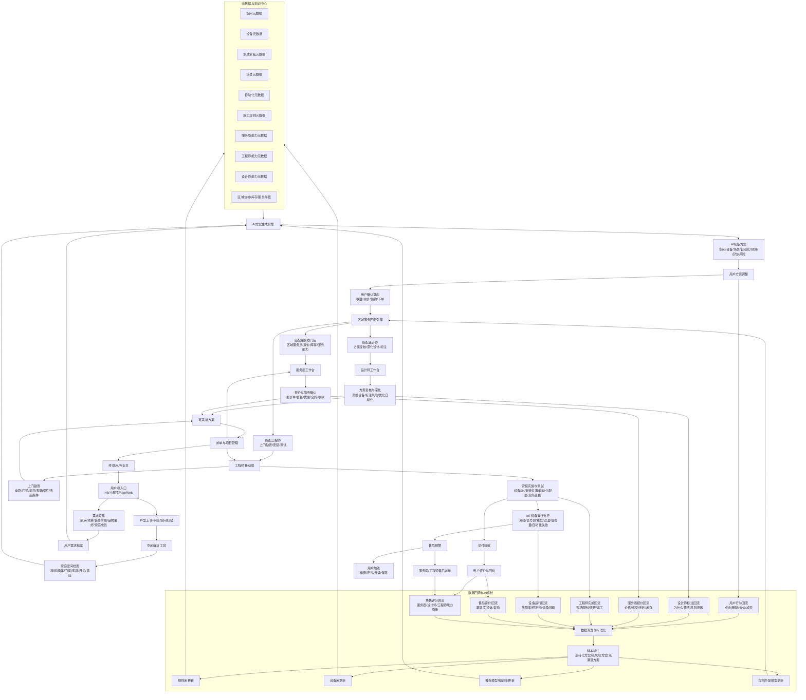

## 4. AI 方案生成引擎与元数据管理

AI 方案生成引擎建议拆成四层：

```text
元数据管理层
→ 规则与约束层
→ 推荐与生成层
→ 评分与回流学习层
```

### 4.1 AI 引擎内部结构

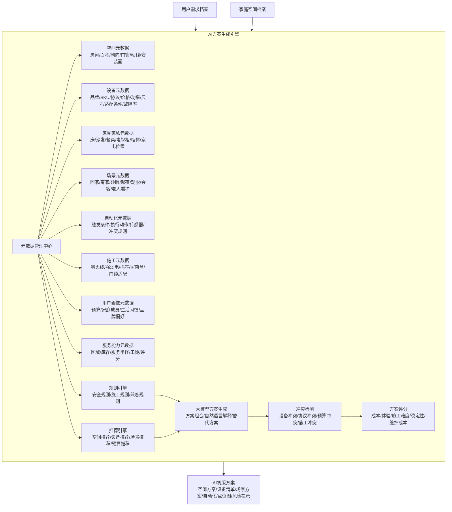

### 4.2 元数据类型

| 元数据类型 | 主要内容 | 作用 |
|---|---|---|
| 空间元数据 | 房间类型、面积、墙体、门窗、朝向、层高、动线 | 判断每个空间适合哪些设备和场景 |
| 设备元数据 | 品牌、型号、协议、价格、功率、尺寸、安装条件、兼容关系 | 生成设备清单和替代方案 |
| 家具家私元数据 | 床、沙发、电视柜、餐桌、衣柜、家电位置 | 判断传感器、灯光、窗帘、开关的位置 |
| 场景元数据 | 回家、离家、睡眠、起夜、观影、会客、老人看护 | 把设备组合成用户能理解的生活方案 |
| 自动化元数据 | 触发条件、执行动作、时间段、设备联动、冲突关系 | 生成可落地的自动化规则 |
| 施工元数据 | 零火线、插座预留、强弱电、门锁适配、窗帘盒、电源位置 | 判断方案是否能实施 |
| 用户画像元数据 | 预算、家庭成员、生活习惯、品牌偏好、装修阶段 | 让方案更个性化 |
| 服务能力元数据 | 服务商区域、工程师技能、设计师能力、库存、工期 | 支撑区域匹配、报价和派单 |
| 运行状态元数据 | 离线、弱信号、低电量、过温、重启、自动化失败 | 反向优化设备推荐和施工规则 |
| 服务交付元数据 | 施工变更、异常、返工、售后评分 | 反向优化方案评分和角色匹配 |

### 4.3 AI 自动学习闭环

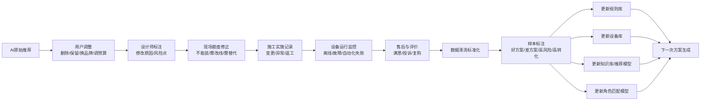

## 5. 系统功能归属标识

| 模块/环节 | 主要用户 | 解决的问题 | 端类型 | 适合交互形态 |
|---|---|---|---|---|
| 用户注册与家庭档案 | 终端用户 | 建立家庭项目，沉淀长期服务关系 | 移动端优先，Web辅助 | 小程序表单、项目卡片、家庭成员管理 |
| 用户需求采集 | 终端用户 | 收集预算、痛点、装修阶段、品牌偏好 | 移动端优先 | 问答式表单、选择题、滑块预算、标签选择 |
| 户型上传/空间扫描 | 终端用户、设计师、工程师 | 获取空间基础数据 | 移动端 + Web | 上传图片、拍照、空间扫描、2D画布 |
| 空间数据解析 | AI系统、设计师 | 把户型转为房间/墙体/门窗/点位 | Web后台 | 自动识别、人工校正、图层编辑 |
| 空间档案管理 | 设计师、工程师、平台 | 统一管理房间、墙体、门窗、家具、点位 | Web为主，移动端查看 | 2D平面图、对象属性面板、图层管理 |
| 元数据管理中心 | 平台运营、产品、AI团队 | 管设备、空间、场景、规则、价格、服务能力 | Web后台 | 表格、树形分类、关系图、版本管理 |
| 设备库管理 | 平台、品牌方、服务商 | 管 SKU、协议、价格、库存、适配条件 | Web后台 | 商品表格、批量导入、参数模板、兼容关系 |
| 家具家私库 | 平台、设计师 | 判断设备安装和场景位置 | Web后台 | 分类库、尺寸模板、空间拖放 |
| 场景库管理 | 平台、设计师 | 管回家、离家、睡眠、观影等标准场景 | Web后台 | 场景模板、条件配置、适用房间选择 |
| 自动化规则库 | 平台、设计师、工程师 | 管触发条件、执行动作、冲突关系 | Web后台 | If-Then 规则编辑器、流程编排、冲突提示 |
| 施工规则库 | 平台、工程师、设计师 | 判断是否能装、怎么预留、哪里有风险 | Web后台 | 规则表、风险标签、施工条件配置 |
| AI方案生成 | 终端用户、设计师、服务商 | 快速生成可理解的初版方案 | 用户端 + Web | 一键生成、方案卡片、预算对比、解释说明 |
| 方案调整工具 | 终端用户、设计师 | 删减设备、换品牌、调预算、标注修改 | Web + 移动端 | 2D点位图、拖拽、侧边属性栏、批注 |
| 方案评分与风险检测 | 设计师、平台、服务商 | 判断成本、体验、施工难度、稳定性 | Web后台 | 分数面板、风险清单、替代方案推荐 |
| 用户询价/预约 | 终端用户 | 把方案转成真实商机 | 移动端优先 | 一键询价、预约时间、授权联系方式 |
| 区域服务匹配 | 平台、用户 | 匹配附近服务商、设计师、工程师 | 系统后台 + 用户端展示 | 推荐列表、地图、评分排序、服务半径 |
| 服务商入驻 | 服务商/门店 | 让本地门店成为区域服务点 | Web + 移动端 | 资质上传、服务范围、品牌能力、门店资料 |
| 服务商工作台 | 服务商/门店 | 接单、报价、派人、看项目进度 | Web为主，移动端辅助 | 订单看板、报价单、客户跟进、库存状态 |
| 设计师入驻 | 设计师 | 建立专业身份和接单能力 | Web + 移动端 | 作品集、擅长空间、认证、接单设置 |
| 设计师工作台 | 设计师 | 复核 AI 方案、深化设计、标注数据 | Web为主 | 平面图编辑、批注、版本对比、方案导出 |
| 工程师入驻 | 安装工程师 | 建立技能、区域、可接单时间 | 移动端优先 | 实名认证、技能标签、服务区域、排班 |
| 工程师移动端 | 安装/售后人员 | 上门勘查、安装记录、调试、售后 | 移动端 | 拍照、扫码、语音备注、勘查表、任务清单 |
| 上门勘查 | 工程师、设计师 | 校验 AI 方案是否能落地 | 移动端 | 标准检查表、照片定位、语音转文字、风险选择 |
| 报价与合同 | 服务商、用户 | 把方案变成订单 | Web + 移动端 | 报价单、套餐选择、电子合同、支付 |
| 派单与项目管理 | 服务商、平台、工程师 | 管实施进度和责任人 | Web + 移动端 | 看板、时间线、任务状态、消息通知 |
| 安装实施记录 | 工程师 | 记录真实安装过程和变更 | 移动端 | 扫码绑定、拍照留档、位置确认、异常上报 |
| 自动化调试 | 工程师、用户 | 把场景真正配置到设备平台 | 移动端 + Web | 调试清单、设备状态、测试按钮、执行日志 |
| 交付验收 | 用户、工程师、服务商 | 确认完成质量，减少纠纷 | 移动端 | 验收清单、签名、照片、自动化测试结果 |
| 服务评价回访 | 用户、平台 | 收集满意度和问题 | 移动端 | 评分、标签、问卷、回访记录 |
| IoT设备监控 | 用户、服务商、平台 | 发现离线、弱信号、过载、低电量 | Web + 移动端 | 状态面板、告警列表、趋势图、推送提醒 |
| 既有设备接入 | 已入住用户、平台 | 接入用户已经安装入网的智能设备 | 移动端优先 | 品牌授权、账号绑定、局域网发现、设备同步 |
| 设备能力盘点 | 用户、AI系统、工程师 | 识别现有设备能做什么、缺什么 | 移动端 + Web | 设备清单、能力标签、房间归属、缺口提示 |
| 自动化体检 | 用户、AI系统 | 判断现有自动化是否缺失、冲突、低效 | 移动端 + Web | 体检评分、问题卡片、冲突提示、优化建议 |
| 既有场景推荐 | 用户、设计师 | 基于现有设备生成可执行场景 | 移动端优先 | 一键启用、场景预览、条件编辑、风险提示 |
| 自动化效果评估 | 用户、AI系统、平台 | 判断新自动化是否真的提升体验 | Web + 移动端 | 执行日志、成功率、用户确认、A/B 对比 |
| 售后工单 | 用户、服务商、工程师 | 维修、更换、升级、保养 | 移动端 + Web | 工单流转、派单、处理记录、结果确认 |
| 数据回流中心 | 平台、AI团队 | 汇总用户、设计、施工、售后数据 | Web后台 | 数据看板、清洗队列、质量评分 |
| 标注平台 | 设计师、工程师、平台运营 | 把过程数据变成 AI 训练数据 | Web后台 | 标注任务、原因标签、样本审核、版本对比 |
| AI迭代管理 | AI团队、平台 | 更新规则、知识库、推荐模型 | Web后台 | 模型版本、规则版本、A/B测试、效果评估 |
| 角色评分体系 | 用户、平台、服务商、工程师、设计师 | 提升开放生态质量 | Web + 移动端 | 评分、履约率、返工率、投诉率、推荐排序 |
| 运营增长工具 | 平台运营、服务商 | 拉新、转化、复购、设备升级 | Web后台 | 活动配置、优惠券、用户分层、消息推送 |

## 6. 端划分

| 端 | 服务对象 | 核心目标 |
|---|---|---|
| 用户小程序/H5 | 终端用户 | 获客、生成方案、预约、验收、售后 |
| 用户 App，可后置 | 深度用户 | 长期设备监控、家庭服务、升级复购 |
| Web 设计工具 | 设计师、平台 | 空间编辑、方案深化、规则标注 |
| 服务商 Web 后台 | 门店/区域服务商 | 接单、报价、派单、项目管理 |
| 工程师移动端 | 安装/售后人员 | 勘查、安装、扫码、调试、售后 |
| 平台管理后台 | 平台运营/AI团队 | 元数据、角色审核、订单监管、数据回流 |
| 品牌方后台 | 设备品牌/供应商 | SKU、价格、库存、兼容参数、售后政策 |

## 7. UML 视角一：系统用例图

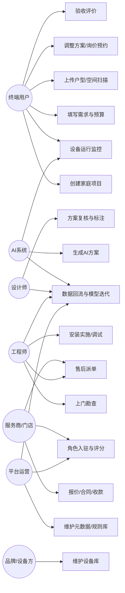

## 8. UML 视角二：项目生命周期状态图

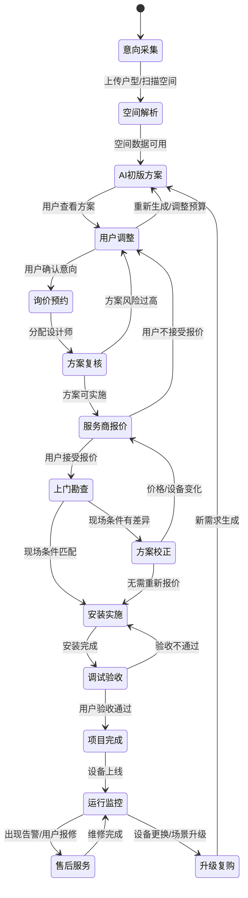

## 9. UML 视角三：用户生成方案场景活动图

适用场景：用户在装修前，希望快速知道自己家适合怎么做智能家居、预算多少、哪里需要预留点位。

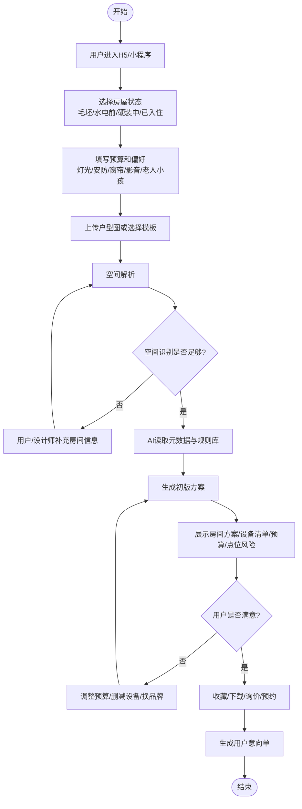

## 10. UML 视角四：设计师复核方案序列图

适用场景：AI 已生成初版方案，用户进入询价或预约阶段，需要设计师确认方案是否专业、是否可落地。

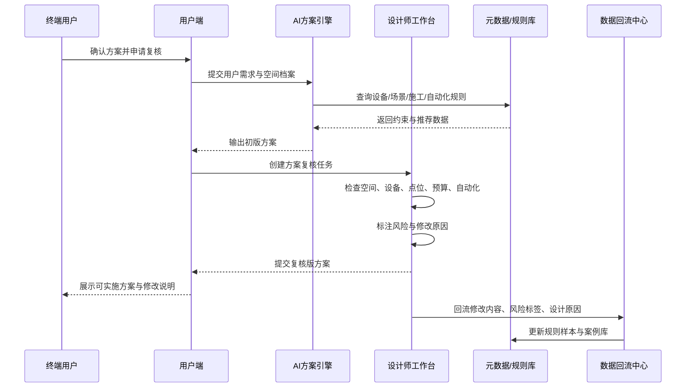

## 11. UML 视角五：服务商报价与区域匹配序列图

适用场景：用户确认意向后，系统需要选择合适的本地服务商进行报价和承接。

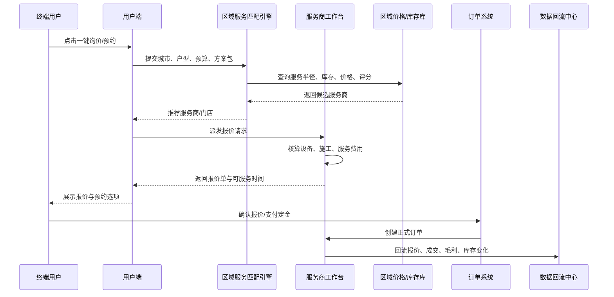

## 12. UML 视角六：工程师上门勘查与安装活动图

适用场景：服务商接单后，工程师上门核实施工条件并完成安装调试。

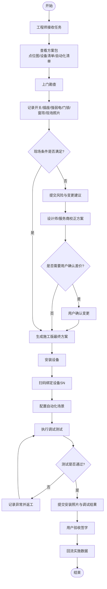

## 13. UML 视角七：售后监控与服务闭环序列图

适用场景：设备交付后，系统持续监控离线、信号弱、频繁重启、过温过载、低电量、自动化失败等问题。

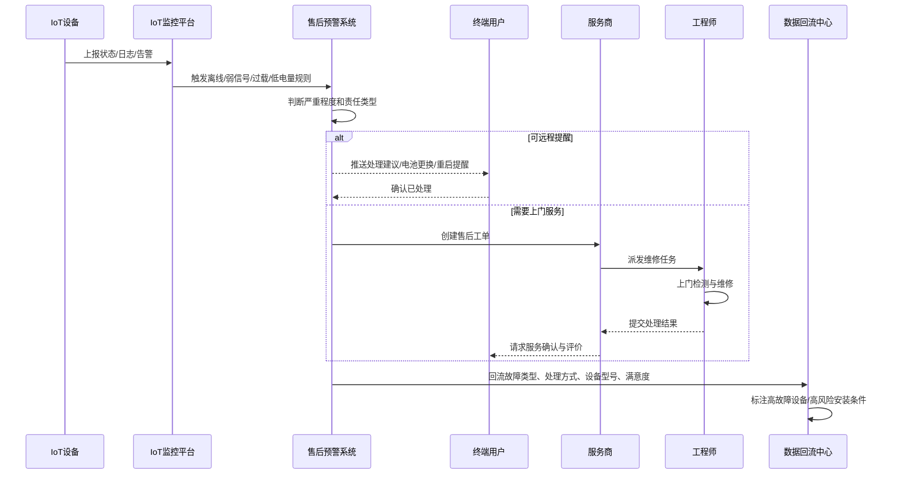

## 14. UML 视角八：AI 学习迭代序列图

适用场景：平台把用户、设计师、服务商、工程师、IoT、售后产生的数据转成 AI 可学习资产。

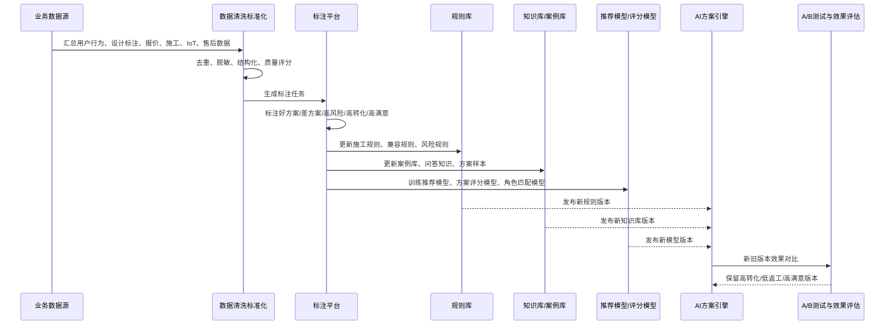

## 15. UML 视角九：核心领域类图

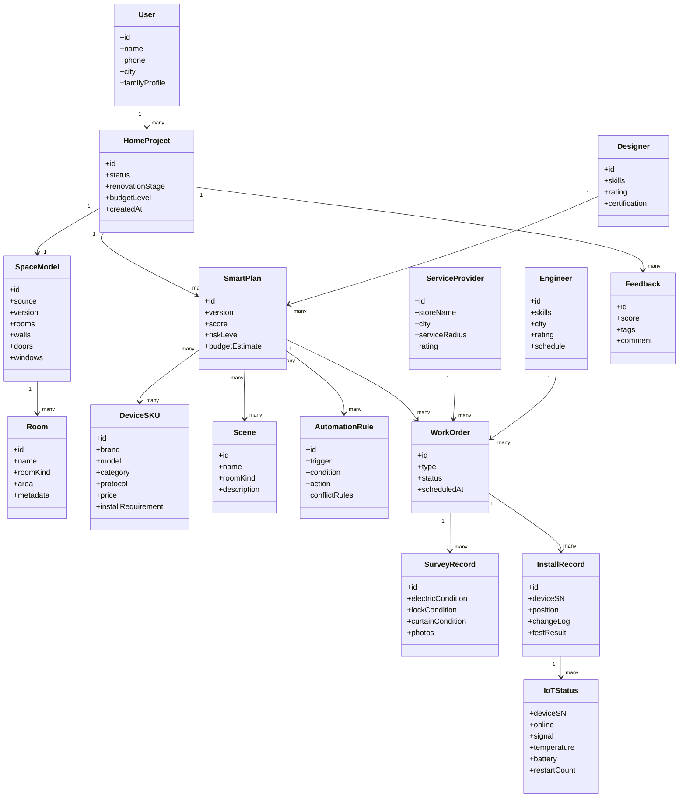

## 16. 按用户场景拆分的核心流程

### 16.1 场景 A：装修前用户获取方案

| 步骤 | 用户动作 | 系统动作 | 数据沉淀 |
|---|---|---|---|
| 1 | 进入 H5/小程序 | 创建临时项目 | 来源渠道、城市、设备信息 |
| 2 | 填装修阶段、预算、偏好 | 生成用户需求档案 | 痛点、预算、品牌偏好 |
| 3 | 上传户型图 | 空间解析 | 房间、墙体、门窗 |
| 4 | 查看 AI 方案 | 生成空间/设备/场景/预算 | 初版方案版本 |
| 5 | 调整方案 | 重新评分和推荐 | 用户删除、保留、替换行为 |
| 6 | 询价预约 | 生成意向单 | 转化意向、联系方式 |

### 16.2 场景 B：设计师深化方案

| 步骤 | 设计师动作 | 系统动作 | 数据沉淀 |
|---|---|---|---|
| 1 | 接收复核任务 | 展示空间模型和 AI 方案 | 任务分配记录 |
| 2 | 检查设备和点位 | 运行风险检测 | 风险项 |
| 3 | 修改方案 | 保存方案版本 | 修改前后差异 |
| 4 | 标注原因 | 结构化标注 | 训练样本 |
| 5 | 提交复核版 | 推送用户/服务商 | 可实施方案包 |

### 16.3 场景 C：服务商报价成交

| 步骤 | 服务商动作 | 系统动作 | 数据沉淀 |
|---|---|---|---|
| 1 | 接收询价 | 匹配区域、库存、服务能力 | 服务商候选记录 |
| 2 | 查看方案包 | 拉取设备清单和施工项 | 报价上下文 |
| 3 | 生成报价 | 计算设备、施工、服务费用 | 报价数据、毛利 |
| 4 | 用户确认 | 创建订单 | 成交数据 |
| 5 | 派发工程师 | 生成工单 | 派单效率、服务半径 |

### 16.4 场景 D：工程师上门实施

| 步骤 | 工程师动作 | 系统动作 | 数据沉淀 |
|---|---|---|---|
| 1 | 接单 | 推送方案包和任务清单 | 接单时间 |
| 2 | 上门勘查 | 打开标准勘查表 | 电路、门锁、窗帘、照片 |
| 3 | 提交风险 | 触发方案校正 | 现场限制 |
| 4 | 安装设备 | 扫码绑定 SN | 设备安装位置 |
| 5 | 配置自动化 | 记录调试结果 | 自动化成功率 |
| 6 | 交付验收 | 用户签字评价 | 服务评分 |

### 16.5 场景 E：售后监控与复购

| 步骤 | 用户/系统动作 | 系统动作 | 数据沉淀 |
|---|---|---|---|
| 1 | 设备持续上报状态 | 监控在线、信号、温度、电量 | 运行状态 |
| 2 | 出现异常 | 触发预警规则 | 故障样本 |
| 3 | 远程提醒或派单 | 创建售后工单 | 处理方式 |
| 4 | 用户确认结果 | 评价售后服务 | 满意度 |
| 5 | 设备老化或场景升级 | 推送更换/升级建议 | 复购意向 |

### 16.6 场景 F：用户已有设备后的自动化提升

适用对象：用户已经购买并安装了智能门锁、灯、开关、窗帘、传感器、空调伴侣、摄像头、网关等设备，设备已经入网，但自动化场景弱、体验割裂、规则混乱或只停留在 App 手动控制。

核心目标：

```text
接入已有设备
→ 识别设备能力和房间归属
→ 诊断场景缺口和自动化冲突
→ 生成可执行的优化场景
→ 用户确认后一键下发或指导配置
→ 监控执行效果
→ 回流学习
```

| 步骤 | 用户/系统动作 | 系统动作 | 数据沉淀 |
|---|---|---|---|
| 1 | 用户授权接入米家/Aqara/华为/涂鸦/HomeKit/Matter 等生态 | 同步设备列表、状态、房间、能力 | 设备资产、协议、能力点 |
| 2 | 用户确认房间归属和生活习惯 | 修正设备与空间关系 | 设备-房间映射、用户习惯 |
| 3 | 系统做自动化体检 | 检测缺失场景、冲突规则、低频规则、失败规则 | 自动化问题样本 |
| 4 | AI 生成优化建议 | 输出可启用场景、替代规则、补充设备建议 | 推荐场景版本 |
| 5 | 用户选择启用 | 下发到设备平台或生成配置指引 | 用户选择、启用率 |
| 6 | 系统监控执行效果 | 统计执行成功率、手动覆盖率、用户取消率 | 场景效果数据 |
| 7 | 系统持续优化 | 调整触发条件、时间段、传感器组合 | 自动化迭代样本 |

## 17. 已有设备自动化提升专项流程

这条链路解决的是另一类用户：不是“我要装修，帮我设计”，而是“我家已经有智能设备，但不好用、不够自动、不成体系”。

### 17.1 已有设备场景数据流

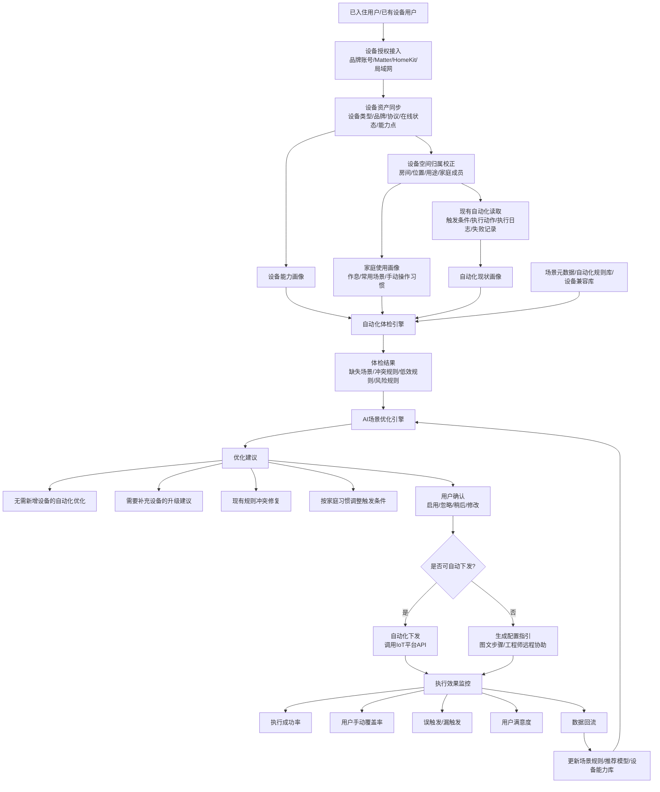

### 17.2 自动化体检维度

| 体检维度 | 判断内容 | 典型问题 | 输出建议 |
|---|---|---|---|
| 场景完整度 | 是否覆盖回家、离家、睡眠、起夜、观影、安防等基础场景 | 有设备但没有场景 | 推荐可直接启用的自动化 |
| 设备利用率 | 设备是否长期只被手动控制 | 智能灯只当普通灯用 | 推荐传感器联动或时间规则 |
| 规则冲突 | 多条自动化是否互相覆盖 | 人在客厅时灯被离家模式关闭 | 合并规则或增加条件 |
| 执行稳定性 | 自动化是否经常失败 | 设备离线、网关弱信号 | 推荐修复网络或调整网关位置 |
| 误触发/漏触发 | 是否频繁不符合用户预期 | 人体传感器延迟关灯 | 调整延迟、亮度、存在传感器 |
| 时间适配 | 是否符合家庭作息 | 夜间灯光过亮 | 按时间段生成不同亮度策略 |
| 空间适配 | 设备是否绑定正确房间 | 卧室传感器触发客厅灯 | 修正房间归属 |
| 安全性 | 自动化是否存在安全风险 | 门锁开门联动关闭安防但无人确认 | 增加二次条件或通知确认 |
| 节能效果 | 是否存在无效用电 | 空调无人时持续运行 | 增加人在/无人判断 |
| 体验一致性 | 不同品牌设备是否割裂 | 米家灯和 HomeKit 传感器无法联动 | 推荐桥接方案或生态替换 |

### 17.3 已有设备用户场景活动图

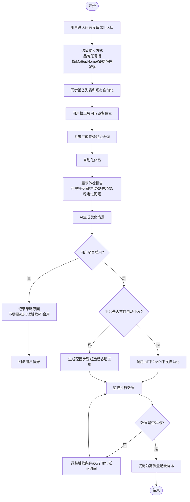

### 17.4 已有设备优化序列图

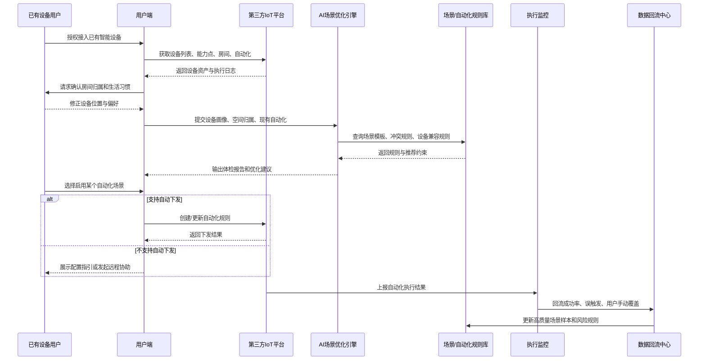

### 17.5 已有设备优化的功能归属

| 模块/环节 | 主要用户 | 解决的问题 | 端类型 | 适合交互形态 |
|---|---|---|---|---|
| 设备授权接入 | 已入住用户 | 把现有设备同步到平台 | 移动端优先 | 品牌账号授权、扫码、Matter 配对、局域网发现 |
| 设备资产盘点 | 用户、平台 | 看清用户家里有什么设备 | 移动端 + Web | 设备卡片、房间分组、在线状态、能力标签 |
| 房间归属校正 | 用户、工程师 | 修正设备和空间的真实关系 | 移动端 | 拖拽到房间、批量选择、语音备注 |
| 现有自动化读取 | AI系统、用户 | 获取用户已经配置的规则 | 后台 + 移动端展示 | 自动化列表、执行日志、失败记录 |
| 自动化体检 | AI系统、用户 | 找出不完整、冲突、低效、不稳定的自动化 | 移动端 + Web | 评分报告、问题卡片、风险标签 |
| 场景优化推荐 | 用户、AI系统 | 用现有设备生成更好用的场景 | 移动端优先 | 一键启用、前后对比、替代建议 |
| 自动化下发 | 用户、IoT平台 | 把推荐规则真正配置到设备生态里 | 后台服务 + 移动端确认 | 授权确认、执行结果、失败重试 |
| 配置指引/远程协助 | 用户、工程师 | 解决生态不开放导致无法自动下发的问题 | 移动端 | 图文步骤、录屏指引、远程工单 |
| 执行效果监控 | 用户、AI系统 | 判断优化后是否真的好用 | 后台 + 移动端 | 成功率、误触发、漏触发、手动覆盖统计 |
| 持续调参 | 用户、AI系统 | 根据使用反馈微调自动化 | 移动端 | 推荐卡片、确认按钮、低打扰提醒 |

### 17.6 典型可提升场景

| 现有设备 | 可提升场景 | 自动化示例 |
|---|---|---|
| 智能门锁 + 玄关灯 + 客厅灯 | 回家模式 | 指纹开锁且时间为夜间，打开玄关灯和客厅低亮度灯 |
| 人体传感器 + 智能灯 | 起夜模式 | 夜间检测到人体移动，打开 10% 暖光，2 分钟无人后关闭 |
| 门窗传感器 + 空调伴侣 | 节能模式 | 窗户打开超过 3 分钟，关闭空调并提醒用户 |
| 智能窗帘 + 光照传感器 | 自然光模式 | 白天光照充足时打开窗帘，强晒时关闭到 50% |
| 智能门锁 + 摄像头 + 网关 | 安防模式 | 离家后门窗异常打开，摄像头录像并推送告警 |
| 电视/投影 + 灯光 + 窗帘 | 观影模式 | 打开投影后关闭窗帘，客厅灯降到 15% |
| 温湿度传感器 + 空调/新风 | 舒适模式 | 温度或湿度超出阈值时自动调节空调或新风 |
| 多品牌设备 | 跨生态场景 | 通过 Matter/Home Assistant/平台桥接实现统一自动化 |

### 17.7 这条链路对系统成长的价值

已有设备用户会带来另一类高价值数据：

- 真实设备存量分布：用户家里已经买了什么品牌、什么品类。
- 真实自动化使用数据：哪些自动化被长期使用，哪些被用户关闭。
- 真实执行效果数据：哪些触发条件容易误判，哪些设备稳定性差。
- 真实升级缺口：用户缺一个传感器、网关或开关，就能明显提升体验。
- 真实跨生态问题：哪些品牌之间难联动，哪些桥接方案更稳定。

这会让系统从“设计新家”扩展成“运营老家”，也就是：

```text
新装修用户
→ 方案设计与实施
→ 设备运行监控
→ 场景持续优化
→ 设备升级复购
→ 长期家庭智能化服务
```

## 18. 系统成长飞轮

### 18.1 用户飞轮

```text
用户上传户型
→ AI生成方案
→ 用户询价/预约
→ 服务商落地
→ 用户评价
→ 案例沉淀
→ 吸引更多用户
```

### 18.2 服务商飞轮

```text
平台给服务商精准客户
→ 服务商愿意入驻
→ 区域服务能力增强
→ 用户更容易成交
→ 平台获得更多真实交付数据
→ AI方案更可落地
```

### 18.3 工程师飞轮

```text
工程师接单
→ 记录真实施工问题
→ 系统知道哪些方案容易返工
→ 派单更精准
→ 工程师效率提升
→ 工程师更愿意使用系统
```

### 18.4 设计师飞轮

```text
AI生成初稿
→ 设计师复核标注
→ AI学习设计判断
→ 初稿质量提高
→ 设计师处理效率提高
→ 更多方案可以被交付
```

### 18.5 设备数据飞轮

```text
设备被推荐
→ 被安装
→ 被监控
→ 产生故障/稳定性数据
→ 推荐模型调整
→ 高质量设备获得更多推荐
```

## 19. 阶段性建设建议

### 19.1 MVP 阶段

优先做：

- 用户需求采集
- 户型上传/模板户型
- AI 初版方案
- 设备清单和预算区间
- 一键询价/预约
- 人工服务商对接

暂缓做：

- 完整 3D 设计器
- 全自动派单
- 全量 IoT 监控
- 复杂模型训练平台

### 19.2 试点阶段

优先接入：

- 1 到 2 个区域服务商
- 3 到 5 名工程师
- 1 到 2 名设计师
- 50 到 100 个真实用户项目

重点验证：

- 用户是否愿意留下联系方式
- 服务商是否愿意报价和接单
- 工程师能否按系统记录现场数据
- AI 方案被修改最多的地方是什么
- 哪些设备、点位、场景最容易成交

### 19.3 平台阶段

重点建设：

- 服务商入驻和评分体系
- 工程师移动端
- 设计师标注平台
- 元数据管理中心
- 数据回流和 AI 版本管理
- IoT 运行监控和售后工单

## 20. 关键护城河

普通 AI 只能生成看起来合理的智能家居方案。

这个开放系统真正应该沉淀的是：

- 真实用户需求数据
- 真实户型和空间数据
- 真实设计师修改数据
- 真实服务商报价和成交数据
- 真实工程师现场实施数据
- 真实设备运行和故障数据
- 真实售后评价和复购数据

最终目标是让系统越来越懂：

```text
什么户型适合什么方案
什么预算容易成交
什么设备稳定性更高
什么点位容易返工
什么服务商适合哪个区域
什么工程师适合哪类任务
什么场景最能打动用户
```
